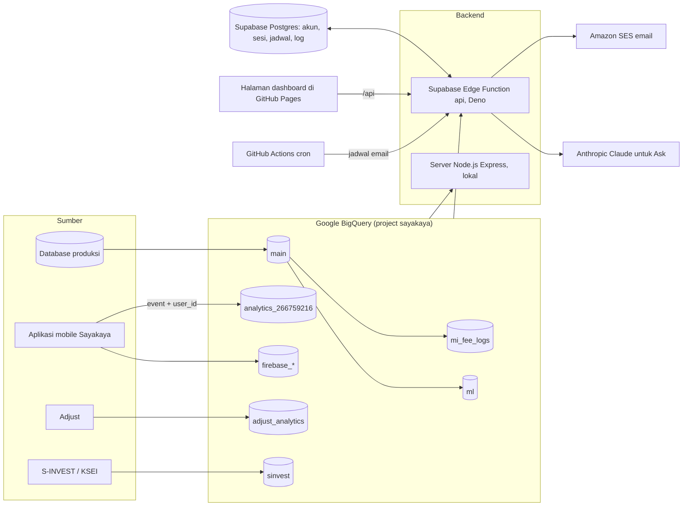

# Dokumentasi Sayakaya Analytics

> File ini dibuat otomatis oleh `scripts/generate-docs.js` setiap kali `npm run docs` atau `npm run deploy:all` dijalankan. Jangan mengedit file ini langsung: ubah kodenya, teks di `docs/content.js`, atau teks tab Documentation di aplikasi, lalu jalankan ulang. Isi ini sesuai kode pada commit `d900547 (2026-10-09)`.

## Cara membaca dokumen ini

Dokumen ini ditulis untuk dua jenis pembaca:

- **Bukan orang teknis** (bisnis, operasional, marketing): baca bagian 1 sampai 3, lalu di bagian 6 baca baris **Untuk apa** dan **Penjelasan sederhana** pada tab yang Anda pakai. Istilah yang asing ada di bagian 2.
- **Orang teknis** (engineer, data analyst): semua bagian. Baris **Cara hitung** dan **Detail teknis** di setiap tab menyebut tabel, kunci join, endpoint API, dan fungsi query di kode. Bagian 4 dan 5 menjelaskan arsitektur dan sumber data.

## Daftar isi

1. [Apa itu Sayakaya Analytics](#1-apa-itu-sayakaya-analytics)
2. [Istilah penting](#2-istilah-penting)
3. [Daftar tab](#3-daftar-tab)
4. [Arsitektur dan teknologi](#4-arsitektur-dan-teknologi)
5. [Sumber data](#5-sumber-data)
6. [Tab demi tab](#6-tab-demi-tab)
7. [Deploy dan pemeliharaan](#7-deploy-dan-pemeliharaan)
8. [Lampiran: endpoint bersama](#8-lampiran-endpoint-bersama)

## 1. Apa itu Sayakaya Analytics

Sayakaya Analytics adalah dashboard internal untuk platform reksa dana Sayakaya. Dashboard ini membaca data langsung dari gudang data perusahaan (Google BigQuery) dan menampilkannya sebagai angka, grafik, dan tabel yang bisa diunduh. Tidak ada angka yang diketik manual: setiap angka dihitung ulang dari data saat halaman dibuka.

Yang bisa dilakukan, secara garis besar:

- **Memantau bisnis**: total dana kelolaan (AUM), pembelian dan penjualan, pertumbuhan pengguna, revenue fee.
- **Melihat investor**: portofolio satu investor dari beberapa sumber data, investor terbesar, investor yang lama tidak membeli.
- **Operasional**: menelusuri transaksi, mencocokkan data aplikasi dengan kustodian, mengirim e-statement dan laporan lewat email (termasuk terjadwal).
- **Revenue dan mitra**: fee yang diterima Sayakaya, bagi hasil remisier, hasil kampanye promo.
- **Marketing dan produk**: atribusi iklan, program referral, push notification, kesehatan aplikasi, dan perilaku pengguna di aplikasi yang dicocokkan dengan database (siapa membeli, di mana orang berhenti, fitur apa yang dipakai).
- **Alat bantu**: bertanya dalam bahasa biasa (Ask), menjelajah tabel mentah, dan menulis query SQL sendiri (read-only).

Akses diatur per orang: admin (superuser) memilih tab mana yang boleh dibuka setiap akun. Saat ini ada 48 tab dalam 8 grup.

## 2. Istilah penting

| Istilah | Artinya |
|---|---|
| AUM (Assets Under Management) | Total nilai uang investor yang dikelola, dalam rupiah: unit yang dipegang dikali NAV. |
| NAV (Net Asset Value) | Harga satu unit reksa dana pada suatu hari. |
| Unit | Satuan kepemilikan reksa dana. Membeli Rp1 juta saat NAV Rp1.000 berarti mendapat 1.000 unit. |
| Subscription / pembelian (buy) | Investor membeli unit reksa dana. Dianggap berhasil setelah dibayar. |
| Redemption / penjualan (sell) | Investor menjual unit dan menerima uangnya kembali. Penuh = semua unit fund itu dijual. |
| Switching | Memindahkan uang dari satu fund ke fund lain tanpa menariknya keluar. |
| KYC | Verifikasi identitas (KTP, selfie, data diri, rekening bank) yang wajib sebelum bisa membeli. |
| SID | Single Investor Identification dari KSEI, nomor unik setiap investor pasar modal. |
| AperD / MI | Agen Penjual Efek Reksa Dana (Sayakaya) dan Manajer Investasi. Fee manajemen dibagi di antara keduanya. |
| Remisier | Mitra perujuk yang mendapat bagi hasil dari AUM nasabah yang dibawanya. |
| PWC / GS | Dua sumber snapshot portofolio: mi_fee_logs.portfolio_with_code (PWC) dan main.goal_snapshots (GS). Beberapa tab punya versi dari keduanya untuk dibandingkan. |
| HNWI | High Net Worth Individual: investor dengan AUM besar. |
| GA4 / Google Analytics | Sistem yang mencatat setiap layar dan tombol yang dipakai orang di aplikasi. |
| user_id | Nomor akun yang ditempelkan aplikasi ke setiap event setelah login. Sama dengan main.users.id, sehingga perilaku di aplikasi bisa dicocokkan dengan transaksi. |
| Event / screen view / sesi | Event = satu aksi tercatat; screen view = satu layar dibuka; sesi = satu kali pemakaian aplikasi (berakhir setelah 30 menit tidak aktif). |
| Funnel | Urutan langkah menuju suatu tujuan (misalnya buka form sampai bayar) dan berapa orang yang bertahan di setiap langkah. |
| Cohort | Sekelompok orang yang dimulai pada waktu yang sama (misalnya mendaftar di bulan yang sama), lalu diikuti perjalanannya. |
| Lift | Berapa kali lebih sering sesuatu terjadi pada orang yang melakukan X dibanding yang tidak. Lift 2 = dua kali lebih sering. Menunjukkan pola, bukan sebab. |
| Median | Nilai tengah setelah diurutkan. Lebih tahan terhadap nilai ekstrem dibanding rata-rata. |
| WIB | Waktu Indonesia Barat (UTC+7). Data mentah disimpan dalam UTC. |
| BigQuery | Gudang data Google tempat semua data analitik disimpan dan dihitung dengan SQL. |
| Supabase | Database dan server kecil (Edge Function) yang menjalankan backend dashboard versi live serta menyimpan akun dan log. |

## 3. Daftar tab

Urutan dan pengelompokan mengikuti sidebar aplikasi. Klik nama tab untuk penjelasan lengkapnya.

**Dashboards (Dasbor)**

| Tab | Untuk apa |
|---|---|
| [Overview](#tab-overview) | Snapshot bisnis: total AUM, jumlah user, volume buy/sell, tren transaksi, breakdown per fund, dan peta sebaran investor. Bisa difilter per produk dan per pengguna (sertakan atau kecualikan berdasarkan kode referrer, kode sales, SID, email, atau akun institusi). |
| [AUM history](#tab-aum) | Pergerakan total AUM dan revenue platform dari waktu ke waktu. |
| [Revenue trend](#tab-revenue-trend) | Tren revenue AperD per hari, minggu, atau bulan, dengan penjelasan penyebab perubahan dan rincian per fund. |
| [Performance](#tab-performance) | Performa NAV tiap fund dari 1 hari sampai 5 tahun, dibandingkan antar fund. |
| [Growth](#tab-growth) | Kinerja campaign promo, referrer teratas, dan alur switching antar fund. |
| [Forecast & churn](#tab-predict) | Forecast AUM dan volume transaksi, risiko churn investor, dan tren retensi. Sebelumnya bernama Predict. |

**Investor**

| Tab | Untuk apa |
|---|---|
| [Portfolio (PWC)](#tab-portfolio) | Cari satu investor (SID, nama, email): holding saat ini, performa, dan riwayat AUM. |
| [Portfolio Explorer (GS)](#tab-portfolio-explorer) | Sama dengan PWC tapi dari sumber kedua, per goal tabungan investor. |
| [Portfolio Explorer (Main)](#tab-portfolio-fix) | Sama dengan PWC, tapi dari tabel harian yang sudah dikoreksi. |
| [Portfolio (TX)](#tab-portfolio-tx) | Lookup investor dengan harga beli rata-rata dari ledger transaksi. |
| [Portfolio (SInvest)](#tab-portfolio-sinvest) | Sama dengan Portfolio (TX) tapi dari feed kustodian KSEI/SInvest, sebagai sumber independen untuk cross-check. |
| [HNWI](#tab-hnwi) | Investor dengan AUM dalam rentang min/max pilihan, per tanggal pilihan, lengkap dengan profil risiko. |
| [Top investors](#tab-top-investors) | Peringkat investor berdasarkan Subscribers, Redeemers, atau Net deposit. |
| [User lifetime](#tab-user-lifetime) | Revenue fee per investor, dibandingkan dengan lama mereka bersama Sayakaya. |
| [Dormant win-back](#tab-dormant) | Dari investor yang lama tidak beli, berapa yang akhirnya beli lagi dan berapa nilainya. |

**Operations & Transactions (Operasional & Transaksi)**

| Tab | Untuk apa |
|---|---|
| [Users transactions](#tab-users-tx) | Telusuri transaksi investor mana pun lewat SID, email, atau nama. |
| [SInvest transactions](#tab-sinvest-tx) | Browse mentah feed KSEI/SInvest, per baris, bisa difilter dan di-export. |
| [Remisier transactions](#tab-remisier-tx) | Detail transaksi di balik angka remisier. |
| [Reconciliation](#tab-reconciliation) | Cek harian apakah angka ledger aplikasi sama dengan feed kustodian. |
| [Send e-statement & portfolio](#tab-send-statement) | Kirim email portfolio, e-statement transaksi bulanan, atau keduanya ke satu investor atau batch. Dulu bernama Send statement. |
| [Send fund performance](#tab-send-fund-performance) | Kirim PDF "Reksa Dana Update" ke daftar email, untuk semua fund, kategori fund tertentu, atau fund pilihan, dengan NAV per tanggal pilihan. |
| [Email recap](#tab-email-recap) | Rekap setiap email yang dikirim dashboard: penerima, subjek, kategori, asal kiriman (manual, batch, jadwal, email akun), keterangan isi, pengirim, lalu status sampai, dibuka, diklik, bounce, dan spam. |

**Revenue & Partners (Pendapatan & Mitra)**

| Tab | Untuk apa |
|---|---|
| [Revenue (PWC)](#tab-revenue) | Fee manajemen yang diterima Sayakaya per fund dan manajer investasi. |
| [Revenue (GS)](#tab-revenue2) | Perhitungan revenue yang sama dari sumber data kedua. |
| [Campaign revenue](#tab-campaign-revenue) | Berapa fee yang didapat balik dari tiap campaign promo. |
| [Remisier sharing (GS)](#tab-remisier) | Revenue-share untuk remisier berdasarkan AUM yang mereka bawa. |
| [Remisier sharing (PWC)](#tab-remisier-pwc) | Perhitungan yang sama dengan sumber AUM berbeda, untuk dibandingkan. |

**Marketing (Pemasaran)**

| Tab | Untuk apa |
|---|---|
| [Marketing attribution](#tab-marketing) | Funnel per channel iklan dari klik sampai pembayaran, beserta revenue. |
| [Referral program](#tab-referral-program) | Laporan eligibility bonus referral Sep sampai Des 2026. |
| [Referral program (KYC based)](#tab-referral-program-alt) | Aturan dan detail sama dengan Referral program, definisi "Invited" berbeda. |
| [Referral activity](#tab-kalcer) | Siapa mengajak siapa dan kapan, dari semua referral antar pengguna di aplikasi (bukan hanya ambassador satu program), plus AUM investor yang diajak pada tanggal pilihan. Dulu bernama Kalcer ambassadors. |
| [Push delivery](#tab-push) | Kesehatan pengiriman push notification: tren, per campaign, per platform. |

**Product (Produk)**

| Tab | Untuk apa |
|---|---|
| [App health](#tab-app-health) | Crash dan trace paling lambat, Android dan iOS digabung. |
| [Product funnel](#tab-product-funnel) | Dari device yang klik Register, berapa yang lanjut OTP, KYC, order, sampai bayar, per platform. |
| [User behavior](#tab-user-behavior) | Menghubungkan aktivitas aplikasi (Google Analytics) dengan database utama: pengguna harian, perilaku per status investor, aksi sebelum pembelian, dampak push, halaman fund dilihat vs dibeli, daftar yang mulai beli tapi tidak bayar, dan linimasa per investor. |
| [Subscription analysis](#tab-subscription-analysis) | Analisis alur beli (subscription) di aplikasi: funnel dari form beli sampai dibayar, dari layar mana orang membuka form beli, di mana mereka keluar dari alur beli, order per metode pembayaran (dibayar, kedaluwarsa, dibatalkan), layar dan aksi yang dilakukan pembeli sebelum membeli, waktu dari daftar ke pembelian pertama, jam dan hari beli, serta tombol nominal cepat. |
| [Onboarding analysis](#tab-onboarding-analysis) | Dari akun dibuat sampai pembelian pertama: layar KYC yang dicapai di aplikasi, hasil review KYC, profil risiko, pembelian dibayar pertama, waktu mengisi KYC, jam review, dan bagian KYC yang dikembalikan. |
| [Redemption analysis](#tab-redemption-analysis) | Alur jual dan switching di aplikasi dicocokkan dengan database, profil penjualan (lama memegang, jenis fund, penuh atau sebagian, membeli lagi, tidak memegang apa pun), dan perilaku di aplikasi sebelum menjual. |
| [Engagement analysis](#tab-engagement-analysis) | Fitur aplikasi yang dipakai dibandingkan dengan kepemilikan dan transaksi, investor menurut besar portofolio dan hari aktif di aplikasi (termasuk uang yang dipegang investor yang tidak membuka aplikasi), kata kunci pencarian sampai fund yang dibeli, dan pilihan urutan, rekomendasi ahli, serta level risiko. |
| [Event code tracking](#tab-event-code) | Tab generik untuk melacak kode referral/sales sebuah event, dibangun sebelum event-nya ada. |

**Tools**

| Tab | Untuk apa |
|---|---|
| [Ask](#tab-ask) | Tanya dalam bahasa biasa (mis. "top 10 funds by AUM") dan dapatkan jawaban dengan chart. |
| [Data explorer](#tab-explorer) | Browse tabel data mentah dengan filter. |
| [SQL lab](#tab-sql) | Menjalankan query read-only sendiri. |
| [Documentation](#tab-docs) | Panduan bahasa sederhana untuk setiap tab, dalam English dan Bahasa Indonesia. Dulu berada di grup Help, sekarang di Tools. |

**Admin**

| Tab | Untuk apa |
|---|---|
| [AI Taskforce](#tab-presentation) | Deck rapat internal, ditampilkan satu halaman per layar. |
| [Monthly Review](#tab-monthly-review) | Deck rapat internal, ditampilkan satu halaman per layar. |
| [Manage users](#tab-admin) | Membuat akun login dan memilih section yang boleh dilihat tiap orang (superuser). |
| [Activity log](#tab-activity-log) | Riwayat login, export, pertanyaan Ask, query SQL, lihat portfolio, lihat linimasa investor di User behavior, dan perubahan akun (superuser). |

## 4. Arsitektur dan teknologi

### 4.1 Gambaran sederhana

Bayangkan tiga lapis:

1. **Data**: semua data perusahaan disalin ke Google BigQuery: database aplikasi (pengguna, transaksi, portofolio), hasil perhitungan fee, catatan aktivitas aplikasi dari Google Analytics, data Firebase, Adjust, dan feed kustodian.
2. **Server**: program kecil yang menerima permintaan dari halaman dashboard, mengecek apakah orang itu boleh melihat tab tersebut, menjalankan query SQL yang sudah disiapkan ke BigQuery, lalu mengembalikan hasilnya. Akun, sesi login, jadwal email, dan log disimpan di Supabase.
3. **Halaman**: satu halaman web yang menggambar tabel dan grafik dari hasil server, dalam Bahasa Inggris atau Indonesia, tema terang atau gelap.

Orang yang membuka dashboard tidak pernah menyentuh BigQuery langsung. Server hanya menjalankan query yang sudah ditulis di kode. SQL lab dan Ask dibatasi read-only, dan kolom sensitif disaring dari setiap hasil.

### 4.2 Diagram alur data

Dari mana halaman tahu server mana yang dipakai: `const API_BASE = location.hostname.endsWith('.github.io') ? 'https://josptpfisrsdjeggkqke.supabase.co/functions/v1' : '';`. Di situs live (github.io) halaman memanggil Supabase Edge Function; saat dijalankan lokal, halaman memanggil server Node di mesin yang sama.

### 4.3 Komponen dan teknologi

| Lapis | Teknologi | Peran |
|---|---|---|
| Halaman (frontend) | HTML, CSS, dan JavaScript biasa tanpa build step (`public/`) | Seluruh tampilan dan interaksi dashboard. |
| Halaman (frontend) | chart.js 4.4.1 (CDN) | Semua grafik. |
| Halaman (frontend) | chartjs-chart-geo 4.3.6 (CDN) | Peta sebaran investor (choropleth). |
| Halaman (frontend) | Google Fonts: Space Grotesk, Inter, JetBrains Mono | Huruf tampilan. |
| Server lokal | Node.js >=18 + Express (`server/`) | Backend untuk pengembangan lokal (`npm start`), Netlify, dan Cloud Run. |
| Server live | Supabase Edge Function `api` di Deno/TypeScript (`supabase/functions/api/`) | Backend yang dipakai situs live. Isinya port dari server Node; query SQL keduanya dijaga identik. |
| Data | Google BigQuery (project `sayakaya`, lokasi asia-southeast2) | Semua data analitik; query dijalankan di sini. |
| Data | BigQuery ML (ARIMA_PLUS, regresi logistik) | Forecast AUM dan transaksi, model risiko churn. |
| Penyimpanan aplikasi | Supabase (Postgres + Storage) | Akun dashboard, sesi, jadwal email, activity log, email log, file deck presentasi. |
| Email | Amazon SES (SMTP lewat nodemailer di Node, API di Deno) | Kirim e-statement, laporan, undangan, reset password; event dibuka/diklik lewat webhook SNS. |
| AI | Anthropic Claude (model default `claude-sonnet-5`, bisa diganti lewat `ANTHROPIC_MODEL`) | Fitur Ask: mengubah pertanyaan bahasa biasa menjadi SQL read-only dan memilih grafik. |
| Hosting halaman | GitHub Pages | Menyajikan folder `public/` untuk situs live. |
| Otomasi | GitHub Actions | Deploy halaman, cron jadwal email. |
| Tes | Node (skrip di `test/`) + jsdom | Merender setiap tab dengan data contoh dan mengecek aturan penting. |

Library Node (dari `package.json`):

| Paket | Versi | Dipakai untuk |
|---|---|---|
| `@google-cloud/bigquery` | ^7.9.1 | Menjalankan query BigQuery. |
| `cors` | ^2.8.5 | Mengizinkan halaman memanggil API dari domain lain. |
| `dotenv` | ^16.4.5 | Membaca pengaturan dari file .env. |
| `exceljs` | ^4.4.0 | Membuat file Excel. |
| `express` | ^4.19.2 | Server HTTP dan routing /api. |
| `google-auth-library` | ^9.15.1 | Login ke Google API (Sheets). |
| `nodemailer` | ^9.0.6 | Kirim email lewat SMTP SES. |
| `pdfkit` | ^0.19.1 | Membuat PDF. |
| `serverless-http` | ^3.2.0 | Menjalankan Express di Netlify Functions. |
| `jsdom` | ^30.1.1 | DOM palsu untuk tes. |

### 4.4 Struktur repo

| Path | Isi |
|---|---|
| `public/index.html` | Seluruh halaman dashboard: sidebar, setiap tab (section), dan tab Documentation. |
| `public/app.js` | Logika frontend: memanggil API, menggambar tabel dan grafik, ekspor, pengaturan akun. |
| `public/i18n.js` | Teks dalam Bahasa Inggris dan Indonesia untuk semua label dan penjelasan. |
| `public/styles.css` | Tampilan: warna, tema terang/gelap, layout responsif. |
| `server/app.js` | Backend Node.js (Express): semua endpoint /api, cek login dan hak akses tab. |
| `server/queries.js` | Semua query SQL BigQuery, satu fungsi (builder) per kebutuhan data. Komentar di atas setiap builder menjelaskan aturannya. |
| `server/bigquery.js` | Koneksi BigQuery, batas biaya per query, dan penyaringan kolom sensitif. |
| `server/auth.js` | Akun, sesi, reset password, dan activity log (di Supabase). |
| `server/ask.js` | Fitur Ask: pertanyaan bahasa biasa diubah menjadi SQL read-only oleh model Claude (Anthropic). |
| `server/explore.js` | Fitur Data explorer: daftar tabel yang boleh dijelajahi beserta filternya. |
| `server/export.js` | Ekspor CSV dan Excel. |
| `server/pdf.js` | Pembuatan PDF laporan portofolio, e-statement, dan performa fund. |
| `server/sheets.js` | Ekspor ke Google Sheets. |
| `server/mail.js` | Pengiriman email lewat Amazon SES, setiap kirim dicatat ke email log. |
| `server/schedules.js` | Jadwal kirim email berulang dan OTP konfirmasinya. |
| `server/ml.js` | Membaca hasil model BigQuery ML (forecast dan churn). |
| `server/ml-train.js` | Melatih ulang model BigQuery ML secara berkala. |
| `server/index.js` | Menjalankan server lokal (npm start). |
| `supabase/functions/api` | Salinan backend dalam Deno (TypeScript) yang berjalan sebagai Supabase Edge Function. Ini backend yang dipakai situs live. |
| `supabase/migrations` | Struktur tabel Supabase (akun, sesi, jadwal, log). |
| `netlify/functions` | Pembungkus backend untuk Netlify (target deploy cadangan). |
| `setup/ml_models.sql` | SQL pembuatan awal model BigQuery ML. |
| `.github/workflows` | GitHub Actions: deploy GitHub Pages, cron jadwal email, deploy Cloud Run. |
| `test` | Tes otomatis (npm test): render setiap tab dengan data contoh, ekspor, format, dan aturan lain. |
| `presentation-docs` | Deck presentasi internal (AI Taskforce, Monthly Review) dan skrip pembuatnya. |
| `docs/content.js` | Teks dokumentasi yang ditulis manusia: ringkasan, dataset, dan cara hitung per tab, deskripsi dataset, istilah. |
| `scripts/generate-docs.js` | Membuat DOKUMENTASI.md dari kode dan docs/content.js. |
| `scripts/deploy-all.sh` | Rutinitas "deploy all": dokumentasi, tes, migrasi, deploy function, push. |

### 4.5 Pengaturan (environment variables)

Diambil dari `.env.example`. Nilai rahasia disimpan di `.env` (lokal) atau sebagai secret Supabase (live), tidak pernah di repo.

| Variabel | Keterangan |
|---|---|
| `GCP_PROJECT_ID` | Project Google Cloud tempat query BigQuery dijalankan dan ditagih (sayakaya). |
| `GOOGLE_APPLICATION_CREDENTIALS` | Path file kunci service account Google untuk pengembangan lokal. Tidak dipakai di Cloud Run. |
| `PORT` | Port server lokal (default 8080). |
| `MAX_BYTES_BILLED` | Batas byte yang boleh ditagih per query BigQuery, pengaman biaya. |
| `BQ_LOCATION` | Lokasi dataset BigQuery (asia-southeast2, Jakarta). |
| `APP_PASSWORD` | Sisa sistem login lama; tidak dipakai lagi. |
| `ANTHROPIC_API_KEY` | Kunci API Anthropic untuk fitur Ask. Kosong = fitur Ask mati. |
| `SUPABASE_URL` | Alamat project Supabase (akun, sesi, jadwal, log). |
| `SUPABASE_SERVICE_ROLE_KEY` | Kunci server Supabase; rahasia, hanya di server. |
| `GSHEET_TRACKER_ID` | Id Google Sheet tujuan ekspor portofolio. Sheet harus dibagikan ke service account sebagai Editor. |
| `SMTP_HOST` | Server SMTP Amazon SES untuk mengirim email. |
| `SMTP_PORT` | Port SMTP (587). |
| `SMTP_USER` | Username SMTP SES (bukan access key IAM biasa). |
| `SMTP_PASS` | Password SMTP SES. |
| `SMTP_FROM` | Alamat pengirim email; harus identitas yang sudah diverifikasi di SES. |
| `CRON_SECRET` | Kunci rahasia yang wajib dikirim pemanggil endpoint cron (jadwal email, latih ulang model) di header X-Cron-Key. |
| `SES_WEBHOOK_SECRET` | Kunci rahasia di URL webhook SNS untuk event email (terkirim, dibuka, diklik). |
| `SES_CONFIGURATION_SET` | Configuration set SES untuk pelacakan email. Biarkan kosong sampai configuration set itu benar-benar ada di SES, karena SES menolak email yang menyebut configuration set yang tidak ada. |

### 4.6 Akses dan keamanan

- **Login**: email/username dan password; password disimpan sebagai hash. Sesi login berlaku 7 hari sejak login, tanpa diperpanjang otomatis.
- **Hak akses per tab**: setiap endpoint dijaga `requireTab(<id tab>)`. Superuser boleh semua tab; akun lain hanya tab yang dicentang di Manage users. Tab Documentation selalu terbuka.
- **Kolom sensitif disaring** dari setiap hasil query, termasuk SQL lab dan Ask, berdasarkan nama kolom: `/^(password|password_hash|id_number|mothers_maiden_name|address|full_address|home_address)$|_photo_url$|signature/i`. Akibatnya query tidak boleh memakai nama kolom yang cocok dengan pola ini untuk data biasa.
- **Batas biaya**: setiap query BigQuery dibatasi 2 GB yang ditagih secara bawaan (bisa diubah lewat `MAX_BYTES_BILLED`). Query yang melebihi batas ditolak BigQuery sebelum berjalan.
- **SQL lab dan Ask hanya membaca**: hanya SELECT/WITH, satu statement, dan tabel yang diizinkan.
- **Activity log**: login, ekspor, pertanyaan Ask, query SQL, melihat portofolio atau linimasa satu investor, dan perubahan akun dicatat.

### 4.7 Proses otomatis

| Workflow | Kapan jalan | Fungsi |
|---|---|---|
| Run due e-statement schedules (`cron-run-schedules.yml`) | cron `3,18,33,48 * * * *` (UTC); manual | Memanggil endpoint cron untuk mengirim email terjadwal yang sudah jatuh tempo. Dalam praktik GitHub menjalankannya tiap beberapa jam, bukan tiap 15 menit. |
| Deploy to Cloud Run (`deploy-cloud-run.yml`) | manual | Deploy server Node ke Cloud Run (pemicu push sedang dimatikan, hanya manual). |
| Deploy GitHub Pages (`gh-pages.yml`) | push ke main yang mengubah path tertentu; manual | Menerbitkan folder public/ ke GitHub Pages saat ada perubahan di public/. |

## 5. Sumber data

### 5.1 Dataset BigQuery

Daftar tabel di bawah dibaca langsung dari SQL di kode, jadi selalu sesuai dengan yang benar-benar dipakai.

#### `adjust_analytics`

Ekspor Adjust (atribusi iklan): klik, install, dan event dari setiap channel iklan, termasuk pembayaran yang dilaporkan aplikasi.

| Tabel | Isi | Dipakai di tab |
|---|---|---|
| `events` | Event atribusi iklan per tracker/channel. | Marketing attribution |

#### `analytics_266759216`

Ekspor Google Analytics 4 (Firebase) dari aplikasi mobile Android dan iOS: setiap layar yang dibuka dan setiap aksi, satu tabel per hari (events_YYYYMMDD), sejak Februari 2026. Setelah login setiap event membawa user_id, yaitu main.users.id, dan itulah kunci join ke database utama.

| Tabel | Isi | Dipakai di tab |
|---|---|---|
| `events_*` | Semua event aplikasi; dibaca per rentang tanggal lewat _TABLE_SUFFIX. | Engagement analysis, Onboarding analysis, Product funnel, Redemption analysis, Subscription analysis, User behavior |

#### `firebase_crashlytics`

Ekspor Firebase Crashlytics: crash dan error aplikasi, satu tabel per platform.

| Tabel | Isi | Dipakai di tab |
|---|---|---|
| `com_sayakaya_android_ANDROID` |  | App health |
| `com_sayakaya_ios_IOS` |  | App health |

#### `firebase_messaging`

Log pengiriman push notification Firebase Cloud Messaging (FCM): diterima atau gagal per pesan. Tidak berisi user_id, jadi tidak bisa dihubungkan ke investor.

| Tabel | Isi | Dipakai di tab |
|---|---|---|
| `data` | Satu baris per status pengiriman push. | Push delivery |

#### `firebase_performance`

Ekspor Firebase Performance Monitoring: durasi pemanggilan API (GraphQL) dan pemuatan layar, satu tabel per platform.

| Tabel | Isi | Dipakai di tab |
|---|---|---|
| `com_sayakaya_android_ANDROID` |  | App health |
| `com_sayakaya_ios_IOS` |  | App health |

#### `main`

Salinan database produksi aplikasi Sayakaya di BigQuery: akun dan profil pengguna, transaksi, kepemilikan (portofolio), produk reksa dana, kampanye promo, referral, dan snapshot NAV/AUM harian. Sumber kebenaran untuk uang dan pengguna.

| Tabel | Isi | Dipakai di tab |
|---|---|---|
| `bonus_portfolios` | Unit bonus dari kampanye promo, dengan status on_going, redeemed, atau succeeded. | Campaign revenue, Data explorer, Engagement analysis, Growth, Overview, Portfolio (PWC), Portfolio (SInvest), Portfolio (TX), Portfolio Explorer (Main), Redemption analysis, Send e-statement & portfolio, User behavior |
| `campaigns` | Kampanye promo: kode, kuota, bonus, periode. | Campaign revenue, Data explorer, Growth |
| `funds` | Daftar reksa dana: nama, jenis, manajer investasi, NAV dan AUM terbaru, fee. | AUM history, Campaign revenue, Data explorer, Engagement analysis, Event code tracking, Growth, Overview, Performance, Portfolio (PWC), Portfolio (SInvest), Portfolio (TX), Portfolio Explorer (GS), Portfolio Explorer (Main), Redemption analysis, Referral program, Referral program (KYC based), Remisier sharing (GS), Remisier sharing (PWC), Remisier transactions, Revenue (GS), Revenue (PWC), Revenue trend, Send e-statement & portfolio, User behavior, User lifetime, Users transactions |
| `geo` | Provinsi dan kota untuk peta sebaran investor. | Overview |
| `goal_snapshots` | Snapshot harian nilai per goal (sumber "GS"). | Portfolio Explorer (GS), Remisier sharing (GS), Revenue (GS) |
| `goals` | Tujuan/portofolio tabungan yang dibuat investor di aplikasi. | Portfolio Explorer (GS), Remisier sharing (GS), Revenue (GS) |
| `investment_managers` | Daftar manajer investasi. | AUM history, Campaign revenue, Data explorer, Growth, Overview, Referral program, Referral program (KYC based), Revenue (GS), Revenue (PWC), Revenue trend, User lifetime |
| `management_fee_logs` | Rate fee manajemen per fund dan perubahannya, termasuk bagian AperD dan MI. | Campaign revenue, Remisier sharing (GS), Remisier sharing (PWC), Revenue (GS), Revenue (PWC), Revenue trend, User lifetime |
| `portfolios` | Kepemilikan unit per investor per fund saat ini, beserta harga beli awal. | Data explorer, Engagement analysis, Forecast & churn, Growth, Overview, Portfolio (PWC), Portfolio (SInvest), Portfolio (TX), Portfolio Explorer (Main), Redemption analysis, Send e-statement & portfolio, User behavior |
| `snapshots` | Riwayat harian NAV (dan AUM) per fund. | Campaign revenue, Performance, Portfolio (PWC), Portfolio (SInvest), Portfolio (TX), Portfolio Explorer (GS), Portfolio Explorer (Main), Send e-statement & portfolio |
| `switching_transactions` | Transaksi switching antar fund: fund asal dan tujuan, nominal, status. | Data explorer, Engagement analysis, Growth, Onboarding analysis, Redemption analysis, Subscription analysis |
| `transactions` | Semua transaksi: buy, sell, SWITCH_IN/OUT, reinvestment; status, nominal (amount, final_amount), metode pembayaran, waktu dibuat dan dibayar. | AUM history, Campaign revenue, Data explorer, Dormant win-back, Engagement analysis, Event code tracking, Forecast & churn, Growth, Onboarding analysis, Overview, Portfolio (PWC), Portfolio (TX), Portfolio Explorer (Main), Reconciliation, Redemption analysis, Referral program, Referral program (KYC based), Remisier transactions, Send e-statement & portfolio, Subscription analysis, Top investors, User behavior, User lifetime, Users transactions |
| `user_profiles` | Profil KYC: nama, nomor HP, tanggal lahir, gender, pekerjaan, tujuan investasi, level risiko. Kolom identitas sensitif disaring oleh dashboard. | Data explorer, Event code tracking, Forecast & churn, Growth, HNWI, Onboarding analysis, Overview, Referral activity, Referral program, Referral program (KYC based), Remisier sharing (GS), Remisier sharing (PWC), Remisier transactions, Send e-statement & portfolio, Subscription analysis, Top investors, User behavior, User lifetime, Users transactions |
| `user_referrals` | Hubungan referral: siapa mengajak siapa dan kapan. | Referral activity, Referral program, Referral program (KYC based) |
| `user_status_logs` | Riwayat perubahan status KYC (pending ke verified atau failed) beserta waktunya, sejak 21 Juli 2026. | Onboarding analysis |
| `users` | Akun pengguna: email, SID, status KYC (verification_status, verified_at), kode referral dan sales, tanggal daftar, akun institusi. | Data explorer, Engagement analysis, Event code tracking, Forecast & churn, Growth, HNWI, Onboarding analysis, Overview, Portfolio Explorer (GS), Redemption analysis, Referral activity, Referral program, Referral program (KYC based), Remisier sharing (GS), Remisier sharing (PWC), Remisier transactions, Send e-statement & portfolio, Subscription analysis, Top investors, User behavior, User lifetime, Users transactions |

#### `mi_fee_logs`

Hasil pipeline perhitungan fee: fee harian per manajer investasi dan snapshot portofolio harian per investor (per SID), dipakai untuk AUM historis dan revenue.

| Tabel | Isi | Dipakai di tab |
|---|---|---|
| `mi_fee` | Fee harian per fund dan AUM harian platform. | AUM history, Forecast & churn |
| `portfolio_fix` | Versi portfolio_with_code dengan harga beli rata-rata yang sudah dikoreksi. | Portfolio (SInvest), Portfolio (TX), Portfolio Explorer (Main), Referral program, Referral program (KYC based), Send e-statement & portfolio |
| `portfolio_with_code` | Snapshot portofolio harian per investor (sumber "PWC"), mulai 14 Januari 2026. | HNWI, Overview, Portfolio (PWC), Portfolio Explorer (GS), Referral activity, Remisier sharing (PWC), Revenue (PWC), Revenue trend, User lifetime |
| `portfolios` |  | Forecast & churn |

#### `ml`

Model BigQuery ML yang dibuat oleh dashboard (forecast AUM dan transaksi, model churn) beserta tabel fiturnya.

| Tabel | Isi | Dipakai di tab |
|---|---|---|
| `aum_forecast` |  | Forecast & churn |
| `churn_features` |  | Forecast & churn |
| `churn_model` |  | Forecast & churn |
| `tx_forecast` |  | Forecast & churn |

#### `sinvest`

Feed transaksi dari S-INVEST (KSEI), sistem kustodian. Sumber independen untuk mencocokkan transaksi aplikasi; semua kolomnya bertipe teks.

| Tabel | Isi | Dipakai di tab |
|---|---|---|
| `trx_history` | Riwayat transaksi dari kustodian. | Data explorer, Portfolio (SInvest), Reconciliation, SInvest transactions |

### 5.2 Tabel, view, dan fungsi Supabase

Dibuat oleh migrasi di `supabase/migrations/` (10 file).

| Nama | Isi |
|---|---|
| `dashboard_users` | Akun login dashboard: username/email, hash password, superuser atau bukan, daftar tab yang boleh dibuka, status undangan. |
| `dashboard_sessions` | Token sesi login (berlaku 7 hari) untuk setiap perangkat yang login. |
| `dashboard_audit_log` | Activity log: login, export, pertanyaan Ask, query SQL lab, lihat portofolio atau linimasa investor, perubahan akun. |
| `dashboard_password_resets` | Token sekali pakai untuk tautan reset password dan undangan. |
| `dashboard_scheduled_jobs` | Jadwal kirim email berulang (e-statement, portofolio, performa fund) dan pengaturannya. |
| `dashboard_schedule_otps` | Kode OTP email untuk mengonfirmasi pembuatan jadwal. |
| `dashboard_schedule_queue` | Antrean pengiriman per jadwal dan per penerima. |
| `dashboard_email_log` | Satu baris per email yang dikirim dashboard: penerima, subjek, kategori, asal, pengirim. |
| `dashboard_email_events` | Event dari Amazon SES per email: terkirim, dibuka, diklik, bounce, spam. |
| `dashboard_email_overview` | View: setiap email beserta status terakhirnya (terkirim, dibuka, diklik, bounce), gabungan dua tabel di atas. |
| `dashboard_email_recap` | Fungsi SQL: rekap email per hari, kategori, dan subjek untuk tab Email recap. |

### 5.3 Menghubungkan aktivitas aplikasi dengan database

Setelah login, aplikasi mobile menempelkan `user_id` ke setiap event yang dikirim ke Google Analytics. `user_id` itu sama dengan `main.users.id`. Dengan satu kunci ini, apa yang dilakukan seseorang di aplikasi (layar yang dibuka, tombol yang ditekan) bisa dicocokkan dengan siapa dia (`main.users`, `main.user_profiles`), apa yang dia beli atau jual (`main.transactions`, `main.switching_transactions`), dan apa yang dia pegang (`main.portfolios`).

Aturan pencocokan yang dipakai di seluruh tab analisis:

- Event sebelum login tidak punya `user_id`, jadi tidak ikut dihitung di analisis per orang.
- Event pasif (push masuk, push ditutup, update aplikasi atau OS) tidak dihitung sebagai memakai aplikasi.
- Transaksi dicocokkan dengan jendela waktu, karena backend dan aplikasi mencatat di detik yang berbeda: baris pembelian ditulis beberapa detik sebelum event `order_created`, sedangkan baris penjualan ditulis sekitar 8 detik setelah `confirm_redeem_click`.
- Pembelian dianggap berhasil bila statusnya completed, completed_payment, atau verified; pembelian bonus yang diinput admin (`manual_bonus`) tidak dihitung.
- Setiap tab analisis menampilkan peta data yang mengukur kecocokan kedua sisi untuk periode yang dipilih: berapa persen `user_id` GA4 ditemukan di `main.users`, dan berapa persen transaksi di database punya event aplikasi yang cocok.

## 6. Tab demi tab

Setiap tab berisi: **Untuk apa** (ringkas), **Penjelasan sederhana** (sama dengan tab Documentation di aplikasi), **Data yang dibaca**, **Cara hitung**, dan **Detail teknis** yang dibaca otomatis dari kode (id tab untuk hak akses, endpoint API, fungsi query, dan tabel yang benar-benar disentuh query).

### Dashboards (Dasbor)

#### Overview

- **Untuk apa**: Snapshot bisnis: total AUM, jumlah user, volume buy/sell, tren transaksi, breakdown per fund, dan peta sebaran investor. Bisa difilter per produk dan per pengguna (sertakan atau kecualikan berdasarkan kode referrer, kode sales, SID, email, atau akun institusi).
- **Penjelasan sederhana**: Ringkasan satu halaman untuk seluruh bisnis: total dana kelolaan (AUM), jumlah pengguna, volume beli/jual, grafik tren transaksi, rincian per produk, dan peta sebaran investor di seluruh Indonesia. Kartu AUM platform punya tanggal acuannya sendiri (terpisah dari rentang tanggal beli/jual di bagian atas halaman) dan hanya menghitung produk yang masih berstatus aktif, karena saldo produk yang sudah dilikuidasi seharusnya tidak lagi dihitung setelah produk itu tidak aktif. Filter produk di atas KPI membatasi AUM, transaksi, dan grafik produk ke satu atau beberapa produk pilihan. Tabel "Produk terbesar berdasarkan AUM" menampilkan semua produk/MI per tanggal pilihan (bukan hanya 10 teratas) beserta porsinya dari total, dan Anda bisa memilih produk mana saja yang ikut dihitung. Membatalkan pilihan sebuah produk juga mengurangi AUM-nya dari total MI-nya. Setiap grafik donat menampilkan porsi tiap bagian dari total di samping namanya. Di sebelah filter produk, filter pengguna menyertakan atau mengecualikan pengguna berdasarkan kode referrer, kode sales, SID, email, atau akun institusi (misalnya, keluarkan semua pengguna dengan referrer RAIZKAYA). Filter ini berlaku untuk semua angka di tab ini, termasuk jumlah pengguna dan tabel Produk terbesar.
- **Data yang dibaca**: main.users, main.user_profiles, main.funds, main.portfolios, main.bonus_portfolios, main.transactions, mi_fee_logs.portfolio_with_code, main.geo
- **Cara hitung**: KPI buy/sell dan transaksi dari main.transactions pada rentang tanggal terpilih. Platform AUM dan tabel Largest funds dari snapshot portfolio_with_code pada tanggal as-of (koreksi -1 hari, hanya fund ACTIVE untuk Platform AUM). Donat AUM per jenis produk memakai funds.latest_aum_value (total AUM tiap produk). Peta dan top kota memakai holding live (unit x latest_nav_value), provinsi dan kota dari main.geo. Filter pengguna: aturan digabung AND, nilai dalam satu aturan OR, tidak peka huruf besar/kecil, * sebagai wildcard, maksimal 300 nilai. Berlaku ke semua angka di tab (dicocokkan lewat users.id, atau sid_code untuk snapshot portfolio_with_code), termasuk export Largest funds. Selama filter aktif, AUM per jenis produk dihitung dari holding live pengguna tersebut, bukan funds.latest_aum_value.
- **Detail teknis** (otomatis dari kode):
  - Id tab untuk hak akses: `overview`
  - Endpoint: `GET /api/overview`, `GET /api/trends`, `GET /api/breakdown/:dimension`, `GET /api/funds/top/latest-date`, `GET /api/funds/top`, `GET /api/users/growth`, `GET /api/users/verification`, `GET /api/users/by-province`, `GET /api/users/top-cities`, `GET /api/users/top-cities-aum`
  - Fungsi query (`server/queries.js`): `breakdownBy`, `largestFundsAum`, `largestFundsLatestDate`, `overviewFunds`, `overviewTx`, `overviewUsers`, `platformAumAsOf`, `topCitiesByAum`, `topCitiesByInvestors`, `trends`, `userGrowth`, `usersByProvince`, `verificationBreakdown`
  - Tabel BigQuery yang disentuh: `main.bonus_portfolios`, `main.funds`, `main.geo`, `main.investment_managers`, `main.portfolios`, `main.transactions`, `main.user_profiles`, `main.users`, `mi_fee_logs.portfolio_with_code`

#### AUM history

- **Untuk apa**: Pergerakan total AUM dan revenue platform dari waktu ke waktu.
- **Penjelasan sederhana**: Bagaimana total dana kelolaan (AUM) dan pendapatan platform berubah dari waktu ke waktu, hanya menghitung produk yang masih berstatus aktif. Saldo sebuah produk berhenti dihitung begitu produk itu dilikuidasi atau dihapus dari pencatatan. Perubahan tiap periode dipecah menjadi arus bersih (dana yang disetor investor dikurangi yang ditarik) dan efek pasar (pergerakan harga dan lainnya), sehingga terlihat apakah AUM naik karena investor menyetor dana atau karena harga naik. Klik periode mana pun untuk melihat produk yang menggerakkannya.
- **Data yang dibaca**: mi_fee_logs.mi_fee, main.funds, main.transactions
- **Cara hitung**: AUM per periode = nilai hari terakhir periode (bukan jumlah). Revenue = jumlah aperd_share_per_day. Net flow = buy dikurangi sell. Market effect = perubahan AUM dikurangi net flow. Tanggal transaksi digeser +1 hari karena baris mi_fee hari D sudah memuat transaksi D-1. Hanya fund ACTIVE.
- **Detail teknis** (otomatis dari kode):
  - Id tab untuk hak akses: `aum`
  - Endpoint: `GET /api/aum-history`, `GET /api/aum-history/drill`
  - Fungsi query (`server/queries.js`): `aumHistory`, `aumHistoryDrill`
  - Tabel BigQuery yang disentuh: `main.funds`, `main.investment_managers`, `main.transactions`, `mi_fee_logs.mi_fee`

#### Revenue trend

- **Untuk apa**: Tren revenue AperD per hari, minggu, atau bulan, dengan penjelasan penyebab perubahan dan rincian per fund.
- **Penjelasan sederhana**: Pendapatan platform dari waktu ke waktu, bisa dilihat total harian, mingguan atau bulanan, beserta perubahan dibanding periode sebelumnya yang dipecah menjadi efek hari, AUM dan tarif fee, serta rincian per produk saat diklik. Cara menghitungnya sama dengan Revenue (PWC).
- **Data yang dibaca**: mi_fee_logs.portfolio_with_code, main.management_fee_logs, main.funds, main.investment_managers
- **Cara hitung**: Memakai perhitungan yang sama persis dengan Revenue (PWC), jadi totalnya sama: AUM harian dikali rate fee, bagian AperD dijumlah per periode. Minggu mulai hari Minggu, sama seperti tab Revenue (PWC). Revenue = hari x rata-rata AUM x rate harian, sehingga perubahan tiap periode dipecah tepat menjadi efek hari (jumlah hari berbeda, termasuk periode awal atau akhir yang terpotong rentang tanggal), efek AUM (rata-rata AUM bergerak, pada rate lama), dan efek rate dan mix (sisanya: rate fee dan komposisi fund). Klik baris untuk melihat fund yang menggerakkannya. Fund yang baru atau hilang di salah satu periode tidak punya rate pembanding, jadi hanya perubahan revenue yang tampil.
- **Detail teknis** (otomatis dari kode):
  - Id tab untuk hak akses: `revenue-trend`
  - Endpoint: `GET /api/revenue-trend`, `GET /api/revenue-trend/drill`
  - Fungsi query (`server/queries.js`): `revenueTrend`, `revenueTrendDrill`
  - Tabel BigQuery yang disentuh: `main.funds`, `main.investment_managers`, `main.management_fee_logs`, `mi_fee_logs.portfolio_with_code`

#### Performance

- **Untuk apa**: Performa NAV tiap fund dari 1 hari sampai 5 tahun, dibandingkan antar fund.
- **Penjelasan sederhana**: Bagaimana kinerja harga (NAV) tiap produk, pilih rentang waktu dari 1 hari hingga 5 tahun dan bandingkan beberapa produk sekaligus.
- **Data yang dibaca**: main.snapshots (type NAV), main.funds
- **Cara hitung**: % perubahan = (NAV terbaru dikurangi NAV pada awal periode) dibagi NAV awal periode. Periode: 1D, 1W, 1M, 3M, YTD, 1Y, 3Y, 5Y. Tanggal acuan relatif terhadap data terbaru tiap fund, bukan hari ini. Rata-rata per tipe fund.
- **Detail teknis** (otomatis dari kode):
  - Id tab untuk hak akses: `performance`
  - Endpoint: `GET /api/product-performance`, `GET /api/product-performance/detail`, `GET /api/product-performance/trend`
  - Fungsi query (`server/queries.js`): `fundNavTrend`, `productPerformance`, `productPerformanceDetail`
  - Tabel BigQuery yang disentuh: `main.funds`, `main.snapshots`

#### Growth

- **Untuk apa**: Kinerja campaign promo, referrer teratas, dan alur switching antar fund.
- **Penjelasan sederhana**: Angka pemasaran dan pertumbuhan: seberapa efektif kampanye promo, siapa yang paling banyak mereferensikan investor baru, dan produk apa yang paling sering dipindahkan (switching) investor.
- **Data yang dibaca**: main.campaigns, main.users, main.transactions, main.switching_transactions, main.investment_managers
- **Cara hitung**: Redemption % = used_quota / quota. Estimasi biaya = used_quota x bonus_amount. Leaderboard referrer = jumlah user dengan referrer_code yang sama plus total buy mereka. Switching = jumlah dan nilai per pasangan fund asal dan tujuan.
- **Detail teknis** (otomatis dari kode):
  - Id tab untuk hak akses: `growth`
  - Endpoint: `GET /api/campaigns/performance`, `GET /api/switching/top-pairs`, `GET /api/funds/by-manager`, `GET /api/users/aum-by-risk`, `GET /api/users/aum-by-income`, `GET /api/referrals/top`
  - Fungsi query (`server/queries.js`): `aumByIncome`, `aumByManager`, `aumByRisk`, `campaignPerformance`, `switchingTopPairs`, `topReferrers`
  - Tabel BigQuery yang disentuh: `main.bonus_portfolios`, `main.campaigns`, `main.funds`, `main.investment_managers`, `main.portfolios`, `main.switching_transactions`, `main.transactions`, `main.user_profiles`, `main.users`

#### Forecast & churn

- **Untuk apa**: Forecast AUM dan volume transaksi, risiko churn investor, dan tren retensi. Sebelumnya bernama Predict.
- **Penjelasan sederhana**: Prediksi berbasis machine learning: proyeksi AUM dan volume transaksi, investor mana yang berisiko keluar (churn), dan tren retensi dari waktu ke waktu.
- **Data yang dibaca**: Model BigQuery ML: sayakaya.ml.aum_forecast, tx_forecast, churn_model
- **Cara hitung**: Forecast AUM dan transaksi memakai ARIMA_PLUS. Churn memakai regresi logistik (LOGISTIC_REG) yang menghasilkan probabilitas per investor. Retensi dihitung sebagai cohort bulanan, untuk user dan untuk AUM.
- **Detail teknis** (otomatis dari kode):
  - Id tab untuk hak akses: `predict`
  - Endpoint: `GET /api/ml/status`, `GET /api/predict/aum`, `GET /api/predict/transactions`, `GET /api/predict/churn`, `GET /api/churn/overview`, `GET /api/retention/cohorts`, `GET /api/retention/aum-cohorts`, `GET /api/ml/retrain-status`
  - Tabel BigQuery yang disentuh: `main.portfolios`, `main.transactions`, `main.user_profiles`, `main.users`, `mi_fee_logs.mi_fee`, `mi_fee_logs.portfolios`, `ml.aum_forecast`, `ml.churn_features`, `ml.churn_model`, `ml.tx_forecast`
  - Tabel Supabase: `dashboard_audit_log`

### Investor

#### Portfolio (PWC)

- **Untuk apa**: Cari satu investor (SID, nama, email): holding saat ini, performa, dan riwayat AUM.
- **Penjelasan sederhana**: Cari satu investor berdasarkan kode SID, nama, atau email, lalu lihat persis produk apa saja yang sedang mereka pegang, bagaimana dananya bertumbuh di berbagai periode, dan riwayat AUM mereka dari waktu ke waktu.
- **Data yang dibaca**: mi_fee_logs.portfolio_with_code, main.users
- **Cara hitung**: Holding dan AUM dari snapshot harian portfolio_with_code. Bisa dipilih as-of date. Ada tombol PDF, Google Sheet, dan Bulk export.
- **Detail teknis** (otomatis dari kode):
  - Id tab untuk hak akses: `portfolio`
  - Endpoint: `GET /api/portfolio`
  - Fungsi query (`server/queries.js`): `userAumHistory`, `userHoldings`, `userHoldingsAsOf`, `userHoldingsLatestDate`, `userPerformance`, `userPortfolioSplit`, `userRecentTransactions`
  - Tabel BigQuery yang disentuh: `main.bonus_portfolios`, `main.funds`, `main.portfolios`, `main.snapshots`, `main.transactions`, `mi_fee_logs.portfolio_with_code`
  - Tabel Supabase: `dashboard_audit_log`

#### Portfolio Explorer (GS)

- **Untuk apa**: Sama dengan PWC tapi dari sumber kedua, per goal tabungan investor.
- **Penjelasan sederhana**: Sama seperti Portfolio (PWC), cari investor dan lihat kepemilikannya, tapi dari sumber data kedua, disusun berdasarkan goal investor, dan bisa dilihat per tanggal mana pun di masa lalu.
- **Data yang dibaca**: main.goals, main.goal_snapshots
- **Cara hitung**: Holding dari goal_snapshots, dikelompokkan per goal, bisa dilihat as-of tanggal lampau.
- **Detail teknis** (otomatis dari kode):
  - Id tab untuk hak akses: `portfolio-explorer`
  - Endpoint: `GET /api/portfolio-explorer`
  - Fungsi query (`server/queries.js`): `goalLatestSnapshotDate`, `goalUserHoldings`, `goalUserHoldingsByGoal`
  - Tabel BigQuery yang disentuh: `main.funds`, `main.goal_snapshots`, `main.goals`, `main.snapshots`, `main.users`, `mi_fee_logs.portfolio_with_code`
  - Tabel Supabase: `dashboard_audit_log`

#### Portfolio Explorer (Main)

- **Untuk apa**: Sama dengan PWC, tapi dari tabel harian yang sudah dikoreksi.
- **Penjelasan sederhana**: Sama seperti Portfolio (PWC), punya fitur snapshot per tanggal yang sama, tapi bersumber dari tabel harian yang sudah dikoreksi (mi_fee_logs.portfolio_fix) yang harga beli rata-ratanya dibobot per unit, bukan dirata-rata per lot, memperbaiki bug cost-basis pada pipeline portfolio_with_code aslinya.
- **Data yang dibaca**: mi_fee_logs.portfolio_fix
- **Cara hitung**: Harga beli rata-rata dibobot per unit, bukan dirata-rata per lot. Ini memperbaiki bug cost basis di pipeline portfolio_with_code.
- **Detail teknis** (otomatis dari kode):
  - Id tab untuk hak akses: `portfolio-fix`
  - Endpoint: `GET /api/portfolio-fix`
  - Fungsi query (`server/queries.js`): `userAumHistoryFix`, `userHoldings`, `userHoldingsAsOfFix`, `userHoldingsLatestDateFix`, `userPerformanceFix`, `userPortfolioSplit`, `userRecentTransactions`
  - Tabel BigQuery yang disentuh: `main.bonus_portfolios`, `main.funds`, `main.portfolios`, `main.snapshots`, `main.transactions`, `mi_fee_logs.portfolio_fix`
  - Tabel Supabase: `dashboard_audit_log`

#### Portfolio (TX)

- **Untuk apa**: Lookup investor dengan harga beli rata-rata dari ledger transaksi.
- **Penjelasan sederhana**: Pencarian investor yang harga beli rata-ratanya dihitung langsung dari ledger transaksi, bukan dari portfolios.initial_price, hanya transaksi buy/SWITCH_IN/reinvestment/transfer_in yang selesai yang memengaruhi rata-rata; penjualan tidak pernah mengubahnya. Mendukung tanggal acuan (direkonstruksi murni dari transaksi sampai tanggal itu; kepemilikan bonus hanya tampil live, karena bonus_portfolios tidak punya riwayat). Anda bisa membatalkan centang baris produk tertentu (mis. saldo sisa kecil) sebelum mengekspor.
- **Data yang dibaca**: main.transactions, main.funds, main.snapshots, main.bonus_portfolios
- **Cara hitung**: Hanya buy, SWITCH_IN, reinvestment, dan transfer_in completed yang mengubah rata-rata. Sell tidak mengubahnya. As-of date direkonstruksi dari transaksi sampai tanggal itu. Holding bonus hanya tersedia live. Baris fund bisa di-uncheck sebelum export.
- **Detail teknis** (otomatis dari kode):
  - Id tab untuk hak akses: `portfolio-tx`
  - Endpoint: `GET /api/portfolio-tx`
  - Fungsi query (`server/queries.js`): `userAumHistoryFix`, `userHoldingsFromTx`, `userHoldingsFromTxAsOf`, `userPerformanceFix`, `userPortfolioSplit`, `userRecentTransactions`
  - Tabel BigQuery yang disentuh: `main.bonus_portfolios`, `main.funds`, `main.portfolios`, `main.snapshots`, `main.transactions`, `mi_fee_logs.portfolio_fix`
  - Tabel Supabase: `dashboard_audit_log`

#### Portfolio (SInvest)

- **Untuk apa**: Sama dengan Portfolio (TX) tapi dari feed kustodian KSEI/SInvest, sebagai sumber independen untuk cross-check.
- **Penjelasan sederhana**: Sama seperti Portfolio (TX), tapi semua angkanya dibangun dari feed kustodian KSEI/SInvest (sinvest.trx_history), bukan dari tabel transaksi milik aplikasi sendiri, sumber kedua yang independen untuk mengecek silang kepemilikan dan harga beli rata-rata seorang investor.
- **Data yang dibaca**: sinvest.trx_history, main.funds
- **Cara hitung**: Semua kolom di sumbernya bertipe STRING, jadi tanggal (YYYYMMDD) dan nominal di-parse dulu. Rumus rata-rata sama dengan versi TX.
- **Detail teknis** (otomatis dari kode):
  - Id tab untuk hak akses: `portfolio-sinvest`
  - Endpoint: `GET /api/portfolio-sinvest`
  - Fungsi query (`server/queries.js`): `sinvestHoldings`, `sinvestHoldingsAsOf`, `sinvestTransactions`, `userAumHistoryFix`, `userPerformanceFix`, `userPortfolioSplit`
  - Tabel BigQuery yang disentuh: `main.bonus_portfolios`, `main.funds`, `main.portfolios`, `main.snapshots`, `mi_fee_logs.portfolio_fix`, `sinvest.trx_history`
  - Tabel Supabase: `dashboard_audit_log`

#### HNWI

- **Untuk apa**: Investor dengan AUM dalam rentang min/max pilihan, per tanggal pilihan, lengkap dengan profil risiko.
- **Penjelasan sederhana**: "High-Net-Worth Individuals", daftar investor dengan kepemilikan dalam rentang AUM tertentu (Anda tentukan ambang batas min/max) per tanggal yang dipilih, termasuk profil risiko tiap investor (tingkat risiko, prioritas investasi, toleransi risiko), lengkap dengan ringkasan total dan fitur ekspor. Rincian per produk di bawah secara default mengikuti daftar investor yang sama; menerapkan filter Min/Max AUM produknya sendiri akan beralih menghasilkan daftarnya sendiri berdasarkan nilai tiap kepemilikan produk, independen dari filter di atas.
- **Data yang dibaca**: mi_fee_logs.portfolio_with_code, main.users, main.user_profiles
- **Cara hitung**: AUM = jumlah amount per SID pada tanggal itu, dengan koreksi -1 hari pada created_at. Breakdown per fund punya filter Min/Max sendiri yang menghasilkan daftar investor sendiri.
- **Detail teknis** (otomatis dari kode):
  - Id tab untuk hak akses: `hnwi`
  - Endpoint: `GET /api/hnwi/latest-date`, `GET /api/hnwi/total`, `GET /api/hnwi/by-fund`
  - Fungsi query (`server/queries.js`): `hnwiByFund`, `hnwiLatestDate`, `hnwiTotal`
  - Tabel BigQuery yang disentuh: `main.user_profiles`, `main.users`, `mi_fee_logs.portfolio_with_code`

#### Top investors

- **Untuk apa**: Peringkat investor berdasarkan Subscribers, Redeemers, atau Net deposit.
- **Penjelasan sederhana**: Mengurutkan investor berdasarkan jumlah yang disetor (Subscriber), ditarik (Redeemer), atau setoran bersih setelah dikurangi penarikan (Net deposit) dalam satu hari, satu minggu, satu bulan, atau rentang tanggal kustom. Pilih urutan menurun atau menaik dan ketik berapa banyak yang ditampilkan (1 sampai 1.000). Tiap baris menampilkan SID, nama, email, nominal, jumlah transaksi, dan porsinya dari total seluruh investor pada periode itu. Versi singkat di bawahnya hanya menampilkan nama, buys, sell, dan net increase, dan bisa diurutkan per kolom. Setiap tabel punya tombol Copy yang menyalin tabel ke clipboard tanpa mengunduh file. Bisa diekspor ke CSV atau Excel.
- **Data yang dibaca**: main.transactions, main.users
- **Cara hitung**: Hanya buy dan sell completed, dibucket per tanggal created_at. Net = buy dikurangi sell. Share % dihitung terhadap total semua investor di periode itu, bukan hanya baris yang ditampilkan. Urutan menurun atau menaik, jumlah baris diketik manual (1 sampai 1.000). Untuk Net deposit, menurun hanya memuat net positif dan menaik hanya net negatif (penarik bersih terbesar). Di bawahnya ada versi singkat (Name, Buys, Sell, Net increase; Buys dan Sell adalah nominal rupiah, Net increase = Buys dikurangi Sell) yang bisa diurutkan per kolom dari baris yang sudah diambil. Semua tabel punya tombol Copy (tab-separated plus HTML) untuk menyalin tanpa mengunduh.
- **Detail teknis** (otomatis dari kode):
  - Id tab untuk hak akses: `top-investors`
  - Endpoint: `GET /api/top-investors`
  - Fungsi query (`server/queries.js`): `topInvestors`
  - Tabel BigQuery yang disentuh: `main.transactions`, `main.user_profiles`, `main.users`

#### User lifetime

- **Untuk apa**: Revenue fee per investor, dibandingkan dengan lama mereka bersama Sayakaya.
- **Penjelasan sederhana**: Pendapatan fee yang sama seperti Revenue (PWC), tapi dijawab per nasabah, bukan per produk: berapa yang dihasilkan masing-masing untuk platform, berdampingan dengan berapa lama mereka bertahan, kapan mendaftar, kapan pertama membeli, dan berapa lama tetap berinvestasi. Klik nasabah mana pun untuk melihat rinciannya per bulan dan per produk.
- **Data yang dibaca**: mi_fee_logs.portfolio_with_code, main.transactions, main.users
- **Cara hitung**: Kolom uang dihitung seperti Revenue (PWC). Tanggal register, beli pertama, dan lama bertahan diambil dari transaksi dan users.created_at, karena portfolio_with_code baru mulai 14 Januari 2026. Klik investor untuk rincian per bulan dan per fund.
- **Detail teknis** (otomatis dari kode):
  - Id tab untuk hak akses: `user-lifetime`
  - Endpoint: `GET /api/user-lifetime`, `GET /api/user-lifetime/summary`, `GET /api/user-lifetime/detail`
  - Fungsi query (`server/queries.js`): `userLifetimeDetail`, `userLifetimeSummary`, `userLifetimeUsers`
  - Tabel BigQuery yang disentuh: `main.funds`, `main.investment_managers`, `main.management_fee_logs`, `main.transactions`, `main.user_profiles`, `main.users`, `mi_fee_logs.portfolio_with_code`

#### Dormant win-back

- **Untuk apa**: Dari investor yang lama tidak beli, berapa yang akhirnya beli lagi dan berapa nilainya.
- **Penjelasan sederhana**: Dihitung langsung dari main.transactions, bukan tabel precomputed. Untuk setiap investor, setiap jeda 14+ hari antara dua pembelian yang selesai adalah "episode tidak aktif", dikelompokkan ke kategori 2 Minggu / 1 Bulan / 2 Bulan / 3 Bulan; dianggap "konversi" jika pembelian berikutnya akhirnya menutup jeda tersebut. Episode yang sudah lebih dari 180 hari tidak aktif dikecualikan, itu sudah dianggap churn, bukan akan segera kembali (populasi itu sudah dicakup model churn di tab Forecast & churn). Menampilkan tingkat konversi dan pendapatan (median berdampingan dengan rata-rata, karena segelintir transaksi besar membuat rata-rata bias) per lama tidak aktif, ditambah dua daftar per pengguna yang bisa diekspor: pembeli berulang (aktivitas pembelian seumur hidup dari semua yang pernah pulih) dan waktu hingga konversi (jumlah hari antara pembelian terakhir sebelum tiap jeda dan pembelian yang menutupnya).
- **Data yang dibaca**: main.transactions (buy completed)
- **Cara hitung**: Per user, selisih dua pembelian berturut-turut (LEAD) di atas 14 hari = satu episode dormant. Bucket 2 Weeks, 1 Month, 2 Month, 3 Month (30 sampai 179 hari ke atas sesuai tingkatnya). Gap 180 hari ke atas dibuang karena dianggap churn. Converted = ada pembelian berikutnya. Revenue dari final_amount pembelian penutup (total, rata-rata, median, maksimum). Ada tabel repeat buyers dan time-to-convert, masing-masing maksimal 1.000 baris.
- **Detail teknis** (otomatis dari kode):
  - Id tab untuk hak akses: `dormant`
  - Endpoint: `GET /api/dormant/conversion-summary`, `GET /api/dormant/repeat-buyers`, `GET /api/dormant/time-to-convert`
  - Fungsi query (`server/queries.js`): `dormantConversionSummary`, `dormantRepeatBuyers`, `dormantTimeToConvert`
  - Tabel BigQuery yang disentuh: `main.transactions`

### Operations & Transactions (Operasional & Transaksi)

#### Users transactions

- **Untuk apa**: Telusuri transaksi investor mana pun lewat SID, email, atau nama.
- **Penjelasan sederhana**: Telusuri transaksi investor mana pun berdasarkan kode SID, email, atau nama (kecocokan sebagian, wajib diisi), lengkap dengan info kontak pembeli dan nama produk di setiap barisnya: join yang sama dengan Remisier transactions, tapi dicari berdasarkan identitas investor, bukan kode referrer/sales. Persempit lebih lanjut dengan jenis transaksi, status, produk, atau rentang tanggal. Bisa diekspor ke CSV, Excel, atau PDF.
- **Data yang dibaca**: main.transactions, main.users, main.user_profiles, main.funds
- **Cara hitung**: Pencarian parsial. Filter tipe, status, fund, dan tanggal. Tiap baris memuat kontak pembeli dan nama fund. Export CSV, Excel, PDF.
- **Detail teknis** (otomatis dari kode):
  - Id tab untuk hak akses: `users-tx`
  - Endpoint: `GET /api/users-transactions`
  - Fungsi query (`server/queries.js`): `usersTransactions`
  - Tabel BigQuery yang disentuh: `main.funds`, `main.transactions`, `main.user_profiles`, `main.users`

#### SInvest transactions

- **Untuk apa**: Browse mentah feed KSEI/SInvest, per baris, bisa difilter dan di-export.
- **Penjelasan sederhana**: Telusuri langsung feed kustodian KSEI/SInvest (sinvest.trx_history), sumber yang sama yang dibandingkan Reconciliation, tapi per baris dan bisa difilter/diekspor, untuk menelusuri transaksi atau investor tertentu.
- **Data yang dibaca**: sinvest.trx_history
- **Cara hitung**: Tanggal diformat ke ISO dan nominal di-cast ke NUMERIC untuk tampilan. Filter tetap memakai string YYYYMMDD.
- **Detail teknis** (otomatis dari kode):
  - Id tab untuk hak akses: `sinvest-tx`
  - Endpoint: `GET /api/sinvest-transactions`
  - Fungsi query (`server/queries.js`): `sinvestTransactions`
  - Tabel BigQuery yang disentuh: `sinvest.trx_history`

#### Remisier transactions

- **Untuk apa**: Detail transaksi di balik angka remisier.
- **Penjelasan sederhana**: Detail transaksi di balik angka remisier sharing, bisa dicari dan difilter.
- **Data yang dibaca**: main.transactions, main.users
- **Cara hitung**: Filter berdasarkan referrer_code atau sales_code, tipe, status, dan tanggal.
- **Detail teknis** (otomatis dari kode):
  - Id tab untuk hak akses: `remisier-tx`
  - Endpoint: `GET /api/transactions/filters`, `GET /api/transactions`, `GET /api/remisier/transactions`
  - Fungsi query (`server/queries.js`): `remisierTransactions`, `transactions`, `txFilterValues`
  - Tabel BigQuery yang disentuh: `main.funds`, `main.transactions`, `main.user_profiles`, `main.users`

#### Reconciliation

- **Untuk apa**: Cek harian apakah angka ledger aplikasi sama dengan feed kustodian.
- **Penjelasan sederhana**: Pengecekan harian untuk memastikan angka di berbagai sistem sudah cocok, gunakan ini untuk menangkap selisih sebelum menjadi masalah nyata.
- **Data yang dibaca**: sinvest.trx_history, main.transactions
- **Cara hitung**: Kedua sisi dijumlah per tanggal dan tipe (dengan baris ALL), lalu di-FULL JOIN. Selisih = nominal app dikurangi nominal SInvest. Kode tipe SInvest 1 sampai 9 dipetakan ke BUY, SELL, SWITCH, dst. Liquidation, transfer, dan unit adjustment belum dibukukan backoffice, jadi tampil hanya di sisi SInvest.
- **Detail teknis** (otomatis dari kode):
  - Id tab untuk hak akses: `reconciliation`
  - Endpoint: `GET /api/reconciliation`
  - Fungsi query (`server/queries.js`): `reconciliationDaily`
  - Tabel BigQuery yang disentuh: `main.transactions`, `sinvest.trx_history`

#### Send e-statement & portfolio

- **Untuk apa**: Kirim email portfolio, e-statement transaksi bulanan, atau keduanya ke satu investor atau batch. Dulu bernama Send statement.
- **Penjelasan sederhana**: Cari investor, lalu kirim email berisi portofolionya (hanya kepemilikan, tanpa rincian performa produk) per tanggal pilihan, e-statement transaksi bulanannya untuk bulan pilihan, atau keduanya dalam satu email. Langkah tulis email menampilkan subjek dan isi yang bisa diedit (sudah terisi surat default) sebelum apa pun dikirim. Setiap PDF lampiran dikunci dengan tanggal lahir investor yang tercatat (DDMMYYYY) sebagai kata sandi pembukanya, atau dibiarkan tanpa kunci jika kami tidak punya tanggal lahirnya, dan surat defaultnya memberi tahu format kata sandinya. Kirim batch mengirim dokumen yang sama ke banyak investor sekaligus: cari berdasarkan nama (* bisa dipakai sebagai wildcard, mis. budi*santoso), SID, email, atau nomor HP lalu tambahkan investor satu per satu, dan/atau tempel daftar email atau SID. Yang tidak cocok dengan investor mana pun dilaporkan kembali, bukan dilewati diam-diam. "+ Jadwal baru" mengubahnya menjadi pengiriman berkala (harian, mingguan, atau bulanan pada jam WIB pilihan) untuk portofolio, e-statement, atau keduanya. Membuat jadwal memerlukan kode sekali pakai yang dikirim ke email orang yang mengaturnya. Jadwal berjalan sampai tanggal berakhir opsional. Melanjutkan jadwal yang dijeda langsung mengirim yang jatuh tempo selama dijeda dan memperbarui tanggal kirim berikutnya. Setiap pengiriman terjadwal tercatat di riwayat yang sama dengan pengiriman manual.
- **Data yang dibaca**: Portfolio tanpa tanggal: main.portfolios + main.bonus_portfolios + main.funds (live). Portfolio dengan tanggal: mi_fee_logs.portfolio_fix + main.snapshots. E-statement: main.transactions + main.funds. Kontak: main.users + main.user_profiles
- **Cara hitung**: Portfolio tanpa tanggal = holding live (unit > 0 plus bonus on_going), nilai = unit x latest_nav_value, harga beli rata-rata dari portfolios.initial_price. Dengan tanggal = snapshot portfolio_fix pada (created_at - 1 hari) itu, NAV dari snapshots tanggal itu (fallback latest_nav_value). E-statement = transaksi status completed, verified, completed_payment dalam bulan terpilih. PDF dikunci tanggal lahir (DDMMYYYY). Batch: cari investor per nama (* sebagai wildcard), SID, email, atau nomor HP (0812/+62 812/812 dianggap sama), tambahkan satu per satu, dan/atau tempel daftar email/SID. Jadwal (OTP email, tanggal akhir opsional) selalu memakai portfolio live dan e-statement bulan lalu. Melanjutkan jadwal yang dijeda langsung mengirim yang terlewat sekali dan memperbarui tanggal kirim berikutnya.
- **Detail teknis** (otomatis dari kode):
  - Id tab untuk hak akses: `send-statement`
  - Endpoint: `GET /api/statement/preview`, `POST /api/statement/email`, `POST /api/statement/email-batch`, `GET /api/statement/log`
  - Fungsi query (`server/queries.js`): `userContact`, `userHoldings`, `userHoldingsAsOfFix`, `userTransactions`, `usersByIdentifiers`
  - Tabel BigQuery yang disentuh: `main.bonus_portfolios`, `main.funds`, `main.portfolios`, `main.snapshots`, `main.transactions`, `main.user_profiles`, `main.users`, `mi_fee_logs.portfolio_fix`
  - Tabel Supabase: `dashboard_audit_log`

#### Send fund performance

- **Untuk apa**: Kirim PDF "Reksa Dana Update" ke daftar email, untuk semua fund, kategori fund tertentu, atau fund pilihan, dengan NAV per tanggal pilihan.
- **Penjelasan sederhana**: Mengirim PDF "Reksa Dana Update" lewat email ke daftar penerima. Pilih produk yang dicakup laporan: semua produk, satu atau beberapa kategori produk, atau produk tertentu, beserta tanggal NAB. Tambahkan penerima dengan mencari nama (* bisa dipakai sebagai wildcard), SID, email, atau nomor HP lalu tambahkan satu per satu, dan/atau tempel daftar email. Setiap penerima mendapat emailnya sendiri, jadi satu alamat yang salah tidak menghambat yang lain. Berbeda dengan Send e-statement & portfolio, ini bisa dikirim ke email siapa pun, investor atau bukan. Punya riwayat kirimnya sendiri, dan "+ Jadwal baru" membuat pengiriman berkala dengan pilihan produk yang sama. Melanjutkan jadwal yang dijeda langsung mengirim yang jatuh tempo selama dijeda dan memperbarui tanggal kirim berikutnya.
- **Data yang dibaca**: main.snapshots (type NAV), main.funds; pencarian penerima dari main.users + main.user_profiles
- **Cara hitung**: % perubahan per periode sama dengan tab Performance. Filter fund diterapkan sebelum PDF dibuat (kategori = funds.type, fund = funds.id); jika filter tidak cocok dengan fund mana pun, kiriman gagal alih-alih mengirim PDF kosong. Penerima dicari per nama (* sebagai wildcard), SID, email, atau nomor HP, atau ditempel. Satu email per penerima. Jadwal menyimpan pilihan fund yang sama (kolom fund_filter); melanjutkan jadwal yang dijeda langsung mengirim yang terlewat sekali dan memperbarui tanggal kirim berikutnya.
- **Detail teknis** (otomatis dari kode):
  - Id tab untuk hak akses: `send-fund-performance`
  - Endpoint: `POST /api/fund-performance/email`, `GET /api/fund-performance/log`
  - Tabel Supabase: `dashboard_audit_log`

#### Email recap

- **Untuk apa**: Rekap setiap email yang dikirim dashboard: penerima, subjek, kategori, asal kiriman (manual, batch, jadwal, email akun), keterangan isi, pengirim, lalu status sampai, dibuka, diklik, bounce, dan spam.
- **Penjelasan sederhana**: Semua email yang dikirim dasbor ini di satu tempat: e-statement dan portofolio, pembaruan kinerja reksa dana, pengiriman terjadwal, dan email akun (undangan, reset kata sandi, kode konfirmasi jadwal, dengan kodenya sendiri tidak pernah disimpan). Setiap email menunjukkan penerima, subjek, kategori, asal pengirimannya (kirim manual, massal, atau jadwal), keterangan singkat isinya, dan siapa yang mengirim. Amazon SES lalu melaporkan apakah email sampai, dibuka, atau diklik, atau bounce atau ditandai spam; tingkat buka dan klik dihitung dari email yang sampai. Saring menurut periode, kategori, dan asal pengiriman; ringkasan per kategori dan per subjek bisa dibaca seperti laporan kampanye, dan Riwayat di setiap baris menampilkan catatan lengkap satu email. Pembukaan dihitung saat gambar dimuat, jadi sebagian aplikasi email bisa mencatat lebih banyak atau lebih sedikit. Email yang dikirim sebelum tab ini ada ikut ditampilkan dari riwayat pengiriman, tanpa data sampai atau dibuka.
- **Data yang dibaca**: Supabase: dashboard_email_log, dashboard_email_events, view dashboard_email_overview, fungsi dashboard_email_recap (bukan BigQuery)
- **Cara hitung**: Satu baris ditulis setiap kali email dikirim (status sent atau failed = diterima atau ditolak SMTP Amazon SES). Event dari SES (Delivery, Open, Click, Bounce, Complaint, Reject, DeliveryDelay) masuk lewat webhook SNS /api/webhooks/ses dan dicocokkan lewat tag log_id atau message id SES. Tingkat buka dan klik = jumlah email dengan minimal satu Open atau Click dibagi email yang Delivered. Hari dihitung dalam WIB. Kode OTP jadwal tidak disimpan, query string tautan yang diklik dibuang (bisa berisi token login). Kiriman sebelum 8 Oktober 2026 diisi ulang dari antrean jadwal dan activity log, tanpa data sampai atau dibuka. Pelacakan sampai, dibuka, diklik aktif setelah configuration set SES disiapkan (SUPABASE-DEPLOY.md, Email tracking).
- **Detail teknis** (otomatis dari kode):
  - Id tab untuk hak akses: `email-recap`
  - Endpoint: `GET /api/email-recap/summary`, `GET /api/email-recap/log`, `GET /api/email-recap/log/:id/events`
  - Tabel Supabase: `dashboard_email_events`, `dashboard_email_overview`, `dashboard_email_recap`

### Revenue & Partners (Pendapatan & Mitra)

#### Revenue (PWC)

- **Untuk apa**: Fee manajemen yang diterima Sayakaya per fund dan manajer investasi.
- **Penjelasan sederhana**: Berapa banyak pendapatan/fee yang diperoleh Sayakaya, dirinci per produk dan manajer investasi, dari masing-masing dari dua sumber data yang dilacak platform (PWC dan GS).
- **Data yang dibaca**: mi_fee_logs.portfolio_with_code, main.management_fee_logs, main.funds, main.investment_managers
- **Cara hitung**: AUM harian dikali rate fee manajemen yang berlaku (latest per management_fee_id) menjadi akrual harian, dipecah ke bagian AperD dan MI. Dikelompokkan per periode dan fund. Ada koreksi -1 hari. Dipakai juga oleh tab Revenue trend.
- **Detail teknis** (otomatis dari kode):
  - Id tab untuk hak akses: `revenue`
  - Endpoint: `GET /api/revenue`, `GET /api/revenue/summary`
  - Fungsi query (`server/queries.js`): `revenueDetail`, `revenueMonthlySummary`
  - Tabel BigQuery yang disentuh: `main.funds`, `main.investment_managers`, `main.management_fee_logs`, `mi_fee_logs.portfolio_with_code`

#### Revenue (GS)

- **Untuk apa**: Perhitungan revenue yang sama dari sumber data kedua.
- **Penjelasan sederhana**: Berapa banyak pendapatan/fee yang diperoleh Sayakaya, dirinci per produk dan manajer investasi, dari masing-masing dari dua sumber data yang dilacak platform (PWC dan GS).
- **Data yang dibaca**: main.goal_snapshots, main.management_fee_logs
- **Cara hitung**: Sama dengan Revenue (PWC), AUM harian dari goal_snapshots. Tanggalnya sudah benar, jadi tidak perlu koreksi -1 hari.
- **Detail teknis** (otomatis dari kode):
  - Id tab untuk hak akses: `revenue2`
  - Endpoint: `GET /api/revenue-v2`, `GET /api/revenue-v2/summary`
  - Fungsi query (`server/queries.js`): `revenueV2Detail`, `revenueV2MonthlySummary`
  - Tabel BigQuery yang disentuh: `main.funds`, `main.goal_snapshots`, `main.goals`, `main.investment_managers`, `main.management_fee_logs`

#### Campaign revenue

- **Untuk apa**: Berapa fee yang didapat balik dari tiap campaign promo.
- **Penjelasan sederhana**: Berapa yang dihasilkan kembali oleh setiap campaign promo. Pembelian yang settle memakai kode promo mengunci unit tersebut, dan bagian ini mengestimasi management fee yang dihasilkan selama unit itu tetap diinvestasikan, sampai nasabah redeem lebih awal, atau menjualnya setelah masa holding berakhir. Ditampilkan bersama biaya bonus campaign sehingga terlihat promo mana yang menutup biayanya sendiri.
- **Data yang dibaca**: main.campaigns, main.bonus_portfolios, main.transactions, main.management_fee_logs
- **Cara hitung**: Unit yang dikunci campaign menghasilkan fee selama masih ditahan: on_going sampai hari ini, redeemed sampai tanggal redeem, succeeded sampai unit dijual (dilacak dari ledger). Dua atribusi penjualan ditampilkan berdampingan: sell memakai unit campaign dulu (utama) atau unit sendiri dulu (kolom alt).
- **Detail teknis** (otomatis dari kode):
  - Id tab untuk hak akses: `campaign-revenue`
  - Endpoint: `GET /api/campaign-revenue`, `GET /api/campaign-revenue/campaigns`, `GET /api/campaign-revenue/summary`
  - Fungsi query (`server/queries.js`): `campaignRevenueByCampaign`, `campaignRevenueDetail`, `campaignRevenueSummary`
  - Tabel BigQuery yang disentuh: `main.bonus_portfolios`, `main.campaigns`, `main.funds`, `main.investment_managers`, `main.management_fee_logs`, `main.snapshots`, `main.transactions`

#### Remisier sharing (GS)

- **Untuk apa**: Revenue-share untuk remisier berdasarkan AUM yang mereka bawa.
- **Penjelasan sederhana**: Menghitung berapa bagi hasil pendapatan yang harus dibayarkan ke remisier (mitra referral) berdasarkan AUM yang mereka bawa, dari masing-masing sumber data.
- **Data yang dibaca**: main.users, main.goal_snapshots, main.management_fee_logs
- **Cara hitung**: Fee remisier adalah porsi tertentu dari bagian AperD (bukan dari fee mentah). Potong PPh 23 sebesar 2,5%, sisanya fee neto. Bagian Sayakaya = AperD dikali (1 - porsi remisier).
- **Detail teknis** (otomatis dari kode):
  - Id tab untuk hak akses: `remisier`
  - Endpoint: `GET /api/remisier/revenue`, `GET /api/remisier/revenue/summary`
  - Fungsi query (`server/queries.js`): `remisierRevenueDetail`, `remisierRevenueSummary`
  - Tabel BigQuery yang disentuh: `main.funds`, `main.goal_snapshots`, `main.goals`, `main.management_fee_logs`, `main.user_profiles`, `main.users`

#### Remisier sharing (PWC)

- **Untuk apa**: Perhitungan yang sama dengan sumber AUM berbeda, untuk dibandingkan.
- **Penjelasan sederhana**: Menghitung berapa bagi hasil pendapatan yang harus dibayarkan ke remisier (mitra referral) berdasarkan AUM yang mereka bawa, dari masing-masing sumber data.
- **Data yang dibaca**: mi_fee_logs.portfolio_with_code, main.users, main.management_fee_logs
- **Cara hitung**: Sama dengan versi GS, tetapi AUM dari portfolio_with_code dengan koreksi -1 hari.
- **Detail teknis** (otomatis dari kode):
  - Id tab untuk hak akses: `remisier-pwc`
  - Endpoint: `GET /api/remisier/revenue-pwc`, `GET /api/remisier/revenue-pwc/summary`
  - Fungsi query (`server/queries.js`): `remisierRevenuePwcDetail`, `remisierRevenuePwcSummary`
  - Tabel BigQuery yang disentuh: `main.funds`, `main.management_fee_logs`, `main.user_profiles`, `main.users`, `mi_fee_logs.portfolio_with_code`

### Marketing (Pemasaran)

#### Marketing attribution

- **Untuk apa**: Funnel per channel iklan dari klik sampai pembayaran, beserta revenue.
- **Penjelasan sederhana**: Dari Adjust, alat atribusi mobile milik aplikasi (dataset sendiri, adjust_analytics.events). Satu baris per channel akuisisi: klik, instal, dan milestone funnel hingga pembayaran yang selesai (OTP terverifikasi, registrasi selesai, KYC terverifikasi, order dibuat, pembayaran selesai), ditambah pendapatan yang dihasilkan. Adjust mengirim event duplikat bertanda ambang batas untuk transaksi yang sama (misalnya payment_completed_1M_plus berdampingan dengan payment_completed polos, ID transaksi yang sama) semata-mata untuk bidding ad-network, sehingga hanya nama event polos yang dihitung, atau pembayaran akan terhitung 2 hingga 3 kali lipat. Hampir semua traffic di data ini adalah "Organic"; sebagian besar channel kecil bernama (post media sosial, link blog, kata kunci pencarian) menunjukkan klik dengan nol instal yang dihasilkan.
- **Data yang dibaca**: adjust_analytics.events
- **Cara hitung**: COUNTIF per activity kind dan event name, per _tracker_name_. Revenue = jumlah _amount_ pada payment_completed. Hanya nama event polos yang dihitung, varian seperti payment_completed_1M_plus dibuang agar pembayaran tidak terhitung 2 sampai 3 kali.
- **Detail teknis** (otomatis dari kode):
  - Id tab untuk hak akses: `marketing`
  - Endpoint: `GET /api/marketing/funnel`
  - Fungsi query (`server/queries.js`): `marketingFunnelByChannel`
  - Tabel BigQuery yang disentuh: `adjust_analytics.events`

#### Referral program

- **Untuk apa**: Laporan eligibility bonus referral Sep sampai Des 2026.
- **Penjelasan sederhana**: Laporan kelayakan program bonus referral periode Sep-Des 2026. Sebuah referral hanya dihitung jika transaksi pertama sepanjang masa dari teman yang diundang adalah pembelian produk Sucor Asset Management minimal Rp1.000.000 memakai kode referral orang lain; bonusnya (Rp25.000 untuk masing-masing pihak, dalam bentuk unit Sucorinvest Money Market Fund) juga mensyaratkan unit produk tersebut tidak berubah selama 30 hari. Setiap baris menampilkan data kontak kedua belah pihak, transaksinya, lama holding, dan status, Eligible, Pending (masih dalam masa hold 30 hari), atau Tidak eligible (lengkap dengan alasannya, misalnya redeem lebih awal atau KYC belum terverifikasi). Di atas detail per baris ada leaderboard pengundang: satu baris per pengundang berisi berapa banyak orang yang diundang dan berapa yang bertransaksi sama sekali (produk/nominal apa pun), lebih luas dari aturan kelayakan itu sendiri, di samping berapa banyak dari referral tersebut yang memenuhi syarat kampanye, dan dari situ, berapa yang Pending vs. Eligible. Di leaderboard ini, "Invited" hanya menghitung teman yang juga mendaftar dalam periode tersebut, referral lama yang tidak pernah berujung pendaftaran/pembelian di periode ini tidak memenuhi daftar. Di bawah leaderboard ada tabel Pengguna yang diundang yang menampilkan populasi "Invited" itu satu baris per orang, siapa yang mengundang (SID dan nama), nama sendiri, tanggal daftar, tanggal verifikasi KYC, SID, email, telepon, kode referral miliknya sendiri, kode referrer yang dipakai saat mendaftar, status KYC, dan status transaksi pertamanya, terpisah dari tabel Detail referral di bawahnya yang hanya mencakup teman yang transaksi pertamanya memenuhi aturan Sucor/≥Rp1jt milik kampanye.
- **Data yang dibaca**: main.users, main.user_referrals, main.transactions
- **Cara hitung**: Referral sah jika transaksi pertama sepanjang masa si invitee adalah pembelian fund Sucor Asset Management minimal Rp1.000.000 dengan kode referral. Bonus Rp25.000 per sisi baru berlaku jika unit ditahan 30 hari. Status: Eligible, Pending (masih masa 30 hari), atau Not eligible beserta alasannya. Leaderboard invitee dihitung dari tanggal registrasi.
- **Detail teknis** (otomatis dari kode):
  - Id tab untuk hak akses: `referral-program`
  - Endpoint: `GET /api/referral-program/detail`, `GET /api/referral-program/inviter-stats`, `GET /api/referral-program/invited`
  - Fungsi query (`server/queries.js`): `referralInvitedUsers`, `referralInviterStats`, `referralProgramDetail`
  - Tabel BigQuery yang disentuh: `main.funds`, `main.investment_managers`, `main.transactions`, `main.user_profiles`, `main.user_referrals`, `main.users`, `mi_fee_logs.portfolio_fix`

#### Referral program (KYC based)

- **Untuk apa**: Aturan dan detail sama dengan Referral program, definisi "Invited" berbeda.
- **Penjelasan sederhana**: Aturan kelayakan, baris detail, dan tab dengan izin terpisah yang sama seperti Referral program di atas, bedanya hanya di definisi "Invited" pada leaderboard pengundang (dan, karenanya, siapa saja yang muncul di tabel Pengguna yang diundang di bawahnya). Di sini, "Invited" ditentukan oleh tanggal verifikasi KYC teman yang diundang, bukan tanggal pendaftarannya (toleransi tetap 1 hari), teman yang terverifikasi dalam periode ini tetap dihitung invited meski mendaftarnya sudah lama, dan yang belum pernah terverifikasi tidak akan pernah dihitung, seberapa pun lama referralnya. Gunakan tab ini saat ingin tahu "siapa yang sudah KYC dan masih berpeluang untuk kampanye ini," bukan "siapa yang mendaftar karena kampanye ini."
- **Data yang dibaca**: Sama dengan Referral program
- **Cara hitung**: Invited ditentukan oleh tanggal verifikasi KYC invitee (dengan grace 1 hari), bukan tanggal registrasi.
- **Detail teknis** (otomatis dari kode):
  - Id tab untuk hak akses: `referral-program-alt`
  - Endpoint: `GET /api/referral-program-alt/detail`, `GET /api/referral-program-alt/inviter-stats`, `GET /api/referral-program-alt/invited`
  - Fungsi query (`server/queries.js`): `referralInvitedUsers`, `referralInviterStatsAlt`, `referralProgramDetail`
  - Tabel BigQuery yang disentuh: `main.funds`, `main.investment_managers`, `main.transactions`, `main.user_profiles`, `main.user_referrals`, `main.users`, `mi_fee_logs.portfolio_fix`

#### Referral activity

- **Untuk apa**: Siapa mengajak siapa dan kapan, dari semua referral antar pengguna di aplikasi (bukan hanya ambassador satu program), plus AUM investor yang diajak pada tanggal pilihan. Dulu bernama Kalcer ambassadors.
- **Penjelasan sederhana**: Siapa mereferensikan siapa, dari semua referral antar pengguna di aplikasi, bukan hanya ambassador satu program. Dibangun dari main.user_referrals (link referral yang tidak berubah, dibuat sekali saat referral terjadi, berbeda dari referrer_code yang bisa dialihkan kemudian) ditambah AUM investor yang direferensikan per tanggal yang dipilih, dari mi_fee_logs.portfolio_with_code, sumber dan koreksi satu hari yang sama seperti tab HNWI. Referrer: satu baris per referrer, dengan berapa banyak orang yang mereka referensikan, tanggal referral pertama dan terakhir, dan gabungan AUM semua yang mereka referensikan. Referral: satu baris per referral, dengan tanggal referral dan AUM investor tersebut. Tidak ada nominal bonus, tier, atau status eligible, aturan pasti program itu tidak terdokumentasi di mana pun dalam codebase ini, jadi bagian ini hanya melaporkan aktivitas referral dan AUM, bukan apa yang dibayarkan ke siapa pun. Bisa dicari berdasarkan SID, nama, atau email referrer.
- **Data yang dibaca**: main.user_referrals, main.users, main.user_profiles, mi_fee_logs.portfolio_with_code
- **Cara hitung**: Link referral dari user_referrals (permanen, berbasis user id: referrer_id = yang mengajak, user_id = yang diajak, created_at = tanggal referral); 6.227 link dari 643 referrer sejak Januari 2022. main.users di-join dua kali (referrer dan invitee) plus user_profiles untuk nama. AUM = jumlah amount positif per SID invitee pada tanggal itu, koreksi -1 hari. Ringkasan per referrer: jumlah referral, referral pertama dan terakhir, total AUM. Tidak memakai dataset kalcer.* (data bonus program Kalcer), yang menghitung referral dengan logika lain sehingga angkanya bisa berbeda. Tidak ada hitungan bonus atau tier. Pencarian bebas berdasarkan SID, nama, atau email.
- **Detail teknis** (otomatis dari kode):
  - Id tab untuk hak akses: `kalcer`
  - Endpoint: `GET /api/kalcer/latest-date`, `GET /api/kalcer/summary`, `GET /api/kalcer/detail`
  - Fungsi query (`server/queries.js`): `kalcerAmbassadorSummary`, `kalcerLatestDate`, `kalcerReferralDetail`
  - Tabel BigQuery yang disentuh: `main.user_profiles`, `main.user_referrals`, `main.users`, `mi_fee_logs.portfolio_with_code`

#### Push delivery

- **Untuk apa**: Kesehatan pengiriman push notification: tren, per campaign, per platform.
- **Penjelasan sederhana**: Log pengiriman milik Firebase Cloud Messaging sendiri (dataset sendiri, firebase_messaging.data): apakah FCM menerima dan meneruskan tiap push. Ini hanya kesehatan jalur pengiriman, bukan tingkat buka atau klik. Ekspor standar Firebase tidak memiliki event engagement semacam itu untuk messaging, dan tabel ini hanya membawa FCM instance ID, bukan user ID Sayakaya, sehingga tidak bisa dihubungkan ke pendapatan juga. Menampilkan volume pengiriman sepanjang rentang tanggal, rincian berdasarkan platform (Android/iOS/tidak diketahui), dan rincian berdasarkan campaign (analytics_label), masing-masing dengan total pengiriman, diterima, MISSING_REGISTRATIONS (token perangkat basi atau tidak valid, alasan kegagalan terbanyak), kegagalan lain, dan tingkat keberhasilan kirim yang dihasilkan.
- **Data yang dibaca**: firebase_messaging.data
- **Cara hitung**: Delivery rate = baris MESSAGE_ACCEPTED dibagi total baris. MISSING_REGISTRATIONS (token device basi) dipisah dari error lain. Hanya kesehatan pengiriman, bukan open atau click, dan tidak ada user_id sehingga tidak bisa dikaitkan ke revenue.
- **Detail teknis** (otomatis dari kode):
  - Id tab untuk hak akses: `push`
  - Endpoint: `GET /api/push/trend`, `GET /api/push/by-campaign`, `GET /api/push/by-platform`
  - Fungsi query (`server/queries.js`): `pushByCampaign`, `pushByPlatform`, `pushTrend`
  - Tabel BigQuery yang disentuh: `firebase_messaging.data`

### Product (Produk)

#### App health

- **Untuk apa**: Crash dan trace paling lambat, Android dan iOS digabung.
- **Penjelasan sederhana**: Firebase Crashlytics + Performance Monitoring, Android dan iOS digabung (dataset sendiri, satu tabel per platform per produk, digabung di sini karena tidak ada tabel gabungan). Crash: satu baris per issue, platform, dan status fatal/non-fatal yang berbeda, dengan jumlah event, jumlah perangkat terdampak, dan versi aplikasi terakhir yang terlihat. Tidak ada angka "total pengguna aktif" di ekspor Crashlytics sendiri, jadi bagian ini tidak bisa menghitung persentase crash-free, hanya jumlah mentah. Performance: durasi median (bukan rata-rata) per query/mutation GraphQL dan custom screen-load trace, minimal 20 sampel. Waktu screen di foreground dan waktu aplikasi di-background dikecualikan sepenuhnya dari tabel ini, Firebase mencatat keduanya di kolom "duration" yang sama tapi mengukur hal yang tidak berkaitan dengan latensi loading, dan sesi background khususnya bisa berjalan berjam-jam, yang kalau tidak dikecualikan akan merusak rata-rata.
- **Data yang dibaca**: firebase_crashlytics (android + ios), firebase_performance (android + ios)
- **Cara hitung**: Crash: per platform, judul issue, dan fatal/non-fatal, dengan jumlah event, device terdampak (DISTINCT installation_uuid), dan versi app terbaru. Performance: hanya DURATION_TRACE, median dan rata-rata dalam ms, minimal 20 sampel. Dwell time layar dan app di background dikecualikan. Tidak ada total pengguna aktif, jadi tidak bisa menghitung crash-free %.
- **Detail teknis** (otomatis dari kode):
  - Id tab untuk hak akses: `app-health`
  - Endpoint: `GET /api/app-health/crashes`, `GET /api/app-health/performance`
  - Fungsi query (`server/queries.js`): `appCrashIssues`, `appPerfTraces`
  - Tabel BigQuery yang disentuh: `firebase_crashlytics.com_sayakaya_android_ANDROID`, `firebase_crashlytics.com_sayakaya_ios_IOS`, `firebase_performance.com_sayakaya_android_ANDROID`, `firebase_performance.com_sayakaya_ios_IOS`

#### Product funnel

- **Untuk apa**: Dari device yang klik Register, berapa yang lanjut OTP, KYC, order, sampai bayar, per platform.
- **Penjelasan sederhana**: Dari Google Analytics (dataset sendiri, analytics_266759216, satu tabel fisik per hari, mulai Feb 2026). Funnel berbasis cohort, bukan penghitungan per tahap dalam periode yang sama: mencari setiap perangkat yang klik Register pertama kalinya jatuh dalam rentang tanggal yang dipilih, lalu memeriksa, tanpa batas tanggal di bagian ini, apakah perangkat yang sama pernah mencapai OTP terkirim, KYC dimulai, KYC terverifikasi, order dibuat, dan pembayaran selesai. Menghitung tiap milestone hanya dalam rentang yang dipilih secara terpisah akan membuat funnel terlihat naik di tengah jalan (otp_on_submit saja terpicu di setiap login, bukan hanya saat daftar, sehingga akan melebihi jumlah pendaftaran), karena orang sungguhan bisa mendaftar di satu periode dan membayar jauh di periode berikutnya. Dipecah per platform (Android/iOS); setiap kolom hanya menurun ke kanan, dalam satu platform. Join milestone ini memindai seluruh riwayat GA4 terlepas dari rentang tanggal yang dipilih, biasanya jauh di bawah 1GB.
- **Data yang dibaca**: analytics_266759216.events_* (ekspor GA4)
- **Cara hitung**: Berbasis cohort: device dengan register_click pertama di rentang tanggal, lalu dicek tanpa batas tanggal apakah pernah mencapai tiap milestone. Cohort dipilih agar funnel tidak naik di tengah, karena orang bisa daftar dan bayar di periode berbeda. Query selalu membaca seluruh histori GA4.
- **Detail teknis** (otomatis dari kode):
  - Id tab untuk hak akses: `product-funnel`
  - Endpoint: `GET /api/product-funnel`
  - Fungsi query (`server/queries.js`): `productFunnelByPlatform`
  - Tabel BigQuery yang disentuh: `analytics_266759216.events_*`

#### User behavior

- **Untuk apa**: Menghubungkan aktivitas aplikasi (Google Analytics) dengan database utama: pengguna harian, perilaku per status investor, aksi sebelum pembelian, dampak push, halaman fund dilihat vs dibeli, daftar yang mulai beli tapi tidak bayar, dan linimasa per investor.
- **Penjelasan sederhana**: Menghubungkan apa yang dilakukan orang di aplikasi (event Google Analytics, yang membawa user ID investor setelah login) dengan transaksi, kepemilikan, dan status KYC di database utama. Untuk periode yang dipilih, tab ini menampilkan: pengguna aplikasi yang login per hari dan berapa di antaranya yang memegang portofolio atau membeli hari itu; aktivitas aplikasi dan pembelian menurut status investor (memegang, sudah dijual habis, terverifikasi tetapi belum pernah membeli, belum terverifikasi); aksi di aplikasi yang muncul sebelum pembelian dalam 7 hari, dibandingkan rata-rata pengguna aplikasi; tingkat buka setiap kampanye push dan pembelian yang menyusul dalam 72 jam; halaman detail reksa dana yang dilihat dibandingkan pembelian reksa dana yang sama; dan daftar tindak lanjut orang yang mulai membeli tetapi tidak pernah membayar. Cari investor mana pun untuk melihat aktivitas aplikasi dan transaksinya dalam satu linimasa, lengkap dengan perangkat, versi aplikasi, dan AUM; setiap pencarian dicatat di Log aktivitas. Aktivitas sebelum login tidak termasuk, dan tab ini menunjukkan kebiasaan pembeli, bukan bukti penyebab mereka membeli.
- **Data yang dibaca**: analytics_266759216.events_* (GA4) dengan user_id = main.users.id, main.transactions, main.portfolios, main.bonus_portfolios, main.users, main.user_profiles, main.funds
- **Cara hitung**: Hanya event yang punya user_id (setelah login). Event pasif (push masuk, push ditutup, update app/OS) tidak dihitung sebagai aktivitas. Status investor = kondisi hari ini: Holding (unit > 0 atau bonus on_going), Redeemed (pernah beli completed, tidak memegang), Verified belum beli, Belum verifikasi. Beli = transaksi buy completed (final_amount), dicocokkan mulai 10 menit sebelum event app karena backend menulis transaksi beberapa detik sebelum app mencatat order_created. Lift aksi = persen yang beli dalam 7 hari sejak pertama melakukan aksi dibagi baseline semua pengguna app (7 hari sejak aktivitas pertama). Push: per message_name, penerima, pembuka, dan pembeli dalam 72 jam. Halaman fund: screen_view ProductDetailScreen (param id = funds.id) lalu beli fund yang sama dalam 7 hari. Daftar tidak bayar: buka form beli atau order_created tanpa buy berstatus completed, completed_payment, atau verified sampai 3 hari setelah percobaan terakhir. Setiap lihat linimasa investor tercatat di Activity log (view_user_journey). Default 30 hari terakhir karena tiap query memindai GA4 sepanjang rentang (sekitar 100 MB per bulan).
- **Detail teknis** (otomatis dari kode):
  - Id tab untuk hak akses: `user-behavior`
  - Endpoint: `GET /api/behavior/user`, `GET /api/behavior/segments`, `GET /api/behavior/daily`, `GET /api/behavior/features`, `GET /api/behavior/push`, `GET /api/behavior/products`, `GET /api/behavior/intent`
  - Fungsi query (`server/queries.js`): `behaviorDaily`, `behaviorFeatureLift`, `behaviorIntentNoBuy`, `behaviorProductInterest`, `behaviorPushImpact`, `behaviorSegments`, `behaviorUserProfile`, `behaviorUserTimeline`
  - Tabel BigQuery yang disentuh: `analytics_266759216.events_*`, `main.bonus_portfolios`, `main.funds`, `main.portfolios`, `main.transactions`, `main.user_profiles`, `main.users`
  - Tabel Supabase: `dashboard_audit_log`

#### Subscription analysis

- **Untuk apa**: Analisis alur beli (subscription) di aplikasi: funnel dari form beli sampai dibayar, dari layar mana orang membuka form beli, di mana mereka keluar dari alur beli, order per metode pembayaran (dibayar, kedaluwarsa, dibatalkan), layar dan aksi yang dilakukan pembeli sebelum membeli, waktu dari daftar ke pembelian pertama, jam dan hari beli, serta tombol nominal cepat.
- **Penjelasan sederhana**: Mengikuti orang yang login melalui alur beli di aplikasi (Google Analytics) dan mencocokkan setiap langkah dengan pembelian yang dibayar di database utama (selesai, pembayaran diterima, atau terverifikasi; pembelian bonus dari admin tidak dihitung). Untuk periode yang dipilih, tab ini menampilkan: funnel langkah dari membuka form beli ke checkout, metode pembayaran, order dibuat, dan dibayar, bisa dipisah per platform, pembeli pertama atau ulang, atau versi aplikasi, lengkap dengan median menit sampai order dan sampai bayar; dari layar mana orang membuka form beli (dan layar sebelumnya) serta berapa yang membayar dalam 3 hari; di mana sesi keluar dari alur beli tanpa order dan apakah orang itu membayar dalam seminggu; setiap order beli per metode pembayaran beserta yang kedaluwarsa, dibatalkan, dan nominal yang tidak dibayar; layar dan aksi yang dilakukan pembeli sebelum pembelian pertama yang dibayar dibandingkan dengan orang yang tidak melakukannya (lift; langkah alur beli disembunyikan kecuali dicentang); jumlah hari dari daftar ke KYC dan ke pembelian pertama untuk pendaftar baru; jam dan hari saat order dibayar dibandingkan dengan pemakaian aplikasi; serta tombol nominal cepat di form beli. Aktivitas sebelum login tidak termasuk, dan perbandingannya menunjukkan kebiasaan pembeli, bukan bukti apa yang membuat mereka membeli. Sebuah panel membandingkan siapa yang membuka form beli dan siapa yang membayar menurut usia, gender, pekerjaan, tujuan investasi, level risiko, dan umur akun dari database utama. Setiap panel menyebut tabel yang dijoin dan dibuka dengan temuan yang ditulis dari angkanya sendiri, dan peta data di bagian atas menunjukkan seberapa cocok data analitik aplikasi dengan database utama pada periode yang dipilih.
- **Data yang dibaca**: analytics_266759216.events_* (GA4) dengan user_id = main.users.id, main.transactions, main.users
- **Cara hitung**: Hanya event yang punya user_id (setelah login). Dibayar = buy berstatus completed, completed_payment, atau verified; pembelian manual_bonus (input admin) tidak dihitung. Funnel per orang: form beli (SubscriptionFormBottomSheet, MultipleSubscriptionFormBottomSheet, atau event buy_bottom_sheet), SubscriptionCheckoutScreen, SubscriptionPaymentMethodBottomSheet, order_created, lalu dibayar (buy dibayar mulai 10 menit sebelum order pertama sampai 1 hari setelah akhir periode). Tiap langkah hanya dihitung jika terjadi setelah langkah sebelumnya, jadi angkanya hanya turun. Dipisah per platform, pembeli pertama atau ulang (ada buy dibayar sebelum pertama buka form), dan versi app saat pertama buka form (GROUPING SETS). Asal form: screen_view tepat sebelumnya di sesi yang sama (LAG per ga_session_id) dan dua layar sebelumnya; dibayar = buy dibayar dalam 3 hari setelah membuka form dari layar itu; kembali ke form dari checkout tidak dihitung. Titik keluar: sesi yang sampai ke form tanpa order_created, per langkah terjauh, dengan layar berikutnya (LEAD) atau keluar aplikasi, dan berapa orang yang membayar dalam 7 hari. Metode pembayaran: semua order buy di periode per payment_method dan bank; nominal tidak dibayar dari amount (final_amount bernilai 0 untuk order yang tidak dibayar); median menit dari created_at ke paid_at; berapa yang ordernya kedaluwarsa atau dibatalkan lalu membayar order lain dalam 7 hari. Pendorong: per layar dan aksi, tingkat bayar orang yang melakukannya dibanding yang tidak melakukannya (lift); pembeli hanya dihitung dari yang dilakukan sebelum buy dibayar pertama (toleransi 2 menit karena app mencatat order_created sampai sekitar 90 detik setelah transaksi tertulis); push yang masuk saat app terbuka (notification_foreground) tidak dihitung; langkah alur beli disembunyikan kecuali dicentang; minimal 20 orang. Waktu ke pembelian pertama: user yang daftar di periode (users.created_at), hari ke verified_at dan ke buy dibayar pertama, median sesi login sebelum beli. Jam beli: porsi session_start (login) dibanding porsi order dibayar per jam atau hari, WIB. Tombol nominal: event price_chips (param nominal), dibayar dalam 1 hari setelah ketukan pertama, dan apakah amount sama dengan nominal tombol. Default 30 hari terakhir (sekitar 100 MB GA4 per bulan per query). Ditambah 9 Oktober 2026: panel profil pembeli dari database utama (usia dari user_profiles.birthdate 17 sampai 90, gender, occupation, investment_purpose, risk_level, umur akun dari users.created_at saat pertama buka form), tingkat bayar dan nominal per kelompok. Setiap panel punya baris Data (tabel dan kunci join) dan kotak Temuan yang dihitung dari baris yang dimuat. Panel peta data menampilkan validitas join untuk periode terpilih (analysisCoverage): persen user_id GA4 yang ada di main.users, persen order beli, penjualan, dan switching di database yang punya event aplikasi yang cocok dalam 10 menit, dan persen pendaftar yang terlihat login.
- **Detail teknis** (otomatis dari kode):
  - Id tab untuk hak akses: `subscription-analysis`
  - Endpoint: `GET /api/analysis/coverage`, `GET /api/subscription/funnel`, `GET /api/subscription/entry`, `GET /api/subscription/dropoff`, `GET /api/subscription/payment`, `GET /api/subscription/drivers`, `GET /api/subscription/timing`, `GET /api/subscription/hours`, `GET /api/subscription/chips`, `GET /api/subscription/profile`
  - Fungsi query (`server/queries.js`): `analysisCoverage`, `subscriptionChips`, `subscriptionDrivers`, `subscriptionDropoff`, `subscriptionEntry`, `subscriptionFunnel`, `subscriptionHours`, `subscriptionPayment`, `subscriptionProfile`, `subscriptionTiming`
  - Tabel BigQuery yang disentuh: `analytics_266759216.events_*`, `main.switching_transactions`, `main.transactions`, `main.user_profiles`, `main.users`

#### Onboarding analysis

- **Untuk apa**: Dari akun dibuat sampai pembelian pertama: layar KYC yang dicapai di aplikasi, hasil review KYC, profil risiko, pembelian dibayar pertama, waktu mengisi KYC, jam review, dan bagian KYC yang dikembalikan.
- **Penjelasan sederhana**: Dimulai dari database utama: setiap akun yang dibuat pada periode yang dipilih (akun institusi tidak dihitung). Untuk setiap orang dicek layar KYC mana yang mereka capai di aplikasi (foto KTP, selfie, data diri, pekerjaan, alamat, rekening bank, tanda tangan, dikirim), lalu review KYC di database utama (terverifikasi pertama kali, terverifikasi setelah gagal review, gagal, menunggu), profil risiko, dan pembelian dibayar pertama. Tab ini menunjukkan penurunan terbesar antar langkah, dipisah per platform; menit dan sesi aplikasi untuk mengisi KYC; jam sampai keputusan review; bagian KYC yang dikembalikan; dan berapa orang terverifikasi yang membeli dalam 7 hari. Setiap panel menyebut tabel yang dijoin dan dibuka dengan temuan yang ditulis dari angkanya sendiri.
- **Data yang dibaca**: main.users (cohort), analytics_266759216.events_* (GA4, user_id = main.users.id), main.user_status_logs, main.user_profiles, main.transactions
- **Cara hitung**: Cohort = akun dengan users.created_at di periode, akun institusi (is_institution) tidak dihitung. Layar KYC GA4 dicari tanpa batas akhir (_TABLE_SUFFIX >= awal periode), urutan aplikasi Sep 2026: VerificationIntroScreen, IdentityPreviewScreen (foto KTP), SelfiePreviewScreen, ProfileVerificationScreen, OccupationVerificationScreen, Address/CorrespondenceAddressVerificationScreen, BankVerificationScreen, SignatureVerificationScreen, VerificationSuccessScreen atau kyc_success (dikirim). Setiap langkah menghitung yang pernah mencapainya (LOGICAL_OR), jadi langkah berikutnya bisa sedikit lebih besar bila event layar hilang. KYC terverifikasi dari users.verification_status, profil risiko dari user_profiles.risk_level, pembelian pertama = buy berstatus completed, completed_payment, atau verified (bukan manual_bonus). Dipisah per platform pertama di GA4 atau tidak terlihat di aplikasi (GROUPING SETS). Hasil KYC: verified pertama kali, verified setelah gagal (ada log failed di user_status_logs), failed, pending, dikirim tapi belum direview, tidak pernah dikirim; median menit dari buka KYC ke kirim, median sesi (ga_session_id) sampai kirim, median jam dari kirim ke keputusan di user_status_logs (sejak 21 Jul 2026), beli dalam 7 hari sejak daftar. Bagian yang dikembalikan dari layar IdentityRejectedScreen, ProfileRejectedScreen, OccupationRejectedScreen, AddressRejectedScreen, BankRejectedScreen beserta yang sekarang terverifikasi. Kolom langkah bernama addr_step dan sign_step karena runQuery menghapus kolom bernama address atau yang mengandung signature (redaksi KYC).
- **Detail teknis** (otomatis dari kode):
  - Id tab untuk hak akses: `onboarding-analysis`
  - Endpoint: `GET /api/analysis/coverage`, `GET /api/onboarding/funnel`, `GET /api/onboarding/outcome`
  - Fungsi query (`server/queries.js`): `analysisCoverage`, `onboardingFunnel`, `onboardingOutcome`
  - Tabel BigQuery yang disentuh: `analytics_266759216.events_*`, `main.switching_transactions`, `main.transactions`, `main.user_profiles`, `main.user_status_logs`, `main.users`

#### Redemption analysis

- **Untuk apa**: Alur jual dan switching di aplikasi dicocokkan dengan database, profil penjualan (lama memegang, jenis fund, penuh atau sebagian, membeli lagi, tidak memegang apa pun), dan perilaku di aplikasi sebelum menjual.
- **Penjelasan sederhana**: Mengikuti investor melalui alur jual (redemption) dan switching di aplikasi dan mencocokkan masing-masing dengan penjualan dan switching yang selesai di database utama. Tab ini menampilkan kedua alur langkah demi langkah; setiap penjualan selesai pada periode ini menurut lama memegang fund, jenis fund, dan jual penuh atau sebagian, beserta berapa penjual yang membeli lagi dalam 30 hari dan berapa yang tidak memegang apa pun hari ini; serta layar dan aksi yang dipakai investor sebelum menjual, dibandingkan dengan investor yang tidak menjual. Setiap panel menyebut tabel yang dijoin dan dibuka dengan temuan yang ditulis dari angkanya sendiri. Perbandingannya menunjukkan pola, bukan sebab.
- **Data yang dibaca**: analytics_266759216.events_* (GA4, user_id), main.transactions, main.switching_transactions, main.funds, main.portfolios, main.bonus_portfolios
- **Cara hitung**: Funnel berurutan per orang (ga4OrderedFunnel): jual = redeem_click atau RedemptionFormBottomSheet, redeem_product_click atau RedemptionCheckoutScreen, confirm_redeem_click, lalu sell selesai di database (status completed, completed_payment, verified, verified_by_operational) mulai 10 menit sebelum konfirmasi; kuesioner redemption muncul setelah konfirmasi jadi bukan langkah. Switching = switch_click atau SwitchProductFormBottomSheet, SwitchProductFundListScreen, switch_product_click atau SwitchProductConfirmationScreen, confirm_switch_click, lalu switching_transactions selesai. Profil: setiap sell selesai di periode (aplikasi atau bukan), nominal COALESCE(NULLIF(final_amount, 0), amount); lama memegang = hari sejak buy atau SWITCH_IN pertama ke fund yang sama; penuh = is_all_unit; membeli lagi = buy dibayar dalam 30 hari; tidak memegang apa pun = AUM live 0; dikonfirmasi di aplikasi = ada confirm_redeem_click dalam 10 menit. Sinyal sebelum menjual: populasi investor yang punya buy dibayar sebelum periode dan terlihat login, lift per layar dan aksi (sama dengan pendorong di Subscription analysis) dengan batas waktu 2 detik sebelum baris sell tertulis, karena baris ditulis median 8 detik setelah konfirmasi dan aplikasi membuka daftar transaksi di detik yang sama. Jalan menuju tombol jual (GoalDetailScreen, product_in_portfolio_click) dan PIN ditandai sebagai alur dan disembunyikan secara bawaan.
- **Detail teknis** (otomatis dari kode):
  - Id tab untuk hak akses: `redemption-analysis`
  - Endpoint: `GET /api/analysis/coverage`, `GET /api/redemption/funnel`, `GET /api/redemption/switching`, `GET /api/redemption/profile`, `GET /api/redemption/signals`
  - Fungsi query (`server/queries.js`): `analysisCoverage`, `redemptionFunnel`, `redemptionProfile`, `redemptionSignals`, `switchingFunnel`
  - Tabel BigQuery yang disentuh: `analytics_266759216.events_*`, `main.bonus_portfolios`, `main.funds`, `main.portfolios`, `main.switching_transactions`, `main.transactions`, `main.users`

#### Engagement analysis

- **Untuk apa**: Fitur aplikasi yang dipakai dibandingkan dengan kepemilikan dan transaksi, investor menurut besar portofolio dan hari aktif di aplikasi (termasuk uang yang dipegang investor yang tidak membuka aplikasi), kata kunci pencarian sampai fund yang dibeli, dan pilihan urutan, rekomendasi ahli, serta level risiko.
- **Penjelasan sederhana**: Mencocokkan apa yang dipakai orang yang login di aplikasi dengan data mereka di database utama. Tab ini menampilkan setiap kelompok fitur (pencarian, urutkan dan filter, watchlist, perencanaan tujuan, kalkulator, notifikasi, dan lainnya) beserta berapa pemakainya yang memegang portofolio, median nilai portofolio mereka, dan berapa yang membeli atau menjual pada periode ini; investor menurut besar portofolio dan berapa hari mereka membuka aplikasi, termasuk berapa banyak uang yang dipegang investor yang tidak membukanya; kata kunci yang diketik orang, apakah mereka mengetuk hasil dan membeli fund itu; serta pilihan urutan, tema rekomendasi ahli, dan level risiko yang dipilih. Setiap panel menyebut tabel yang dijoin dan dibuka dengan temuan yang ditulis dari angkanya sendiri.
- **Data yang dibaca**: analytics_266759216.events_* (GA4, user_id), main.portfolios, main.bonus_portfolios, main.funds, main.transactions, main.users
- **Cara hitung**: Fitur = event dan layar GA4 dikelompokkan (pencarian, urutkan dan filter, watchlist, perbandingan, rekomendasi ahli, perencanaan tujuan, kalkulator, berita dan edukasi, promo, referral, notifikasi, bantuan, halaman manajer dan grup fund, e-statement dan pajak; daftar di ENG_FEATURES). Per fitur: pengguna login, yang memegang portofolio hari ini (unit x latest_nav_value, termasuk bonus), median AUM, membeli dan menjual di periode (buy dibayar, sell selesai), dibandingkan baris semua pengguna aplikasi. Aktivitas: investor yang memegang unit hasil beli di main.portfolios (bukan hanya bonus, bukan institusi), tier AUM (di bawah 1 jt, 1 sampai 10 jt, 10 sampai 100 jt, 100 jt sampai 1 M, 1 M ke atas) x hari aktif GA4 di periode (0, 1 sampai 2, 3 sampai 9, 10 ke atas; event pasif tidak dihitung). Pencarian: search_trigger param name (huruf kecil), search_result_click di sesi yang sama dalam 30 menit, buy dibayar dalam 7 hari, dan buy fund yang diketuk (product_name dicocokkan ke funds.name); kata kunci yang dipakai kurang dari 2 orang disembunyikan karena bisa berisi nomor referensi atau nama. Pilihan: sort_filter_apply (sort_by, sort_return_period), mutual_fund_by_expert_click (goal_name), risk_profile_gate_completed (level), lalu buy dibayar dalam 7 hari.
- **Detail teknis** (otomatis dari kode):
  - Id tab untuk hak akses: `engagement-analysis`
  - Endpoint: `GET /api/analysis/coverage`, `GET /api/engagement/features`, `GET /api/engagement/search`, `GET /api/engagement/discovery`, `GET /api/engagement/activity`
  - Fungsi query (`server/queries.js`): `analysisCoverage`, `engagementActivity`, `engagementDiscovery`, `engagementFeatures`, `engagementSearch`
  - Tabel BigQuery yang disentuh: `analytics_266759216.events_*`, `main.bonus_portfolios`, `main.funds`, `main.portfolios`, `main.switching_transactions`, `main.transactions`, `main.users`

#### Event code tracking

- **Untuk apa**: Tab generik untuk melacak kode referral/sales sebuah event, dibangun sebelum event-nya ada.
- **Penjelasan sederhana**: Tab generik yang siap pakai untuk melacak kode referral/sales milik sebuah event, dibuat sebelum ada event sungguhan, belum ada kode atau kampanye yang diatur, jadi pilih salah satu dari users.sales_code atau users.referrer_code yang nanti dipakai event tersebut, lalu ketik kodenya. Menampilkan funnel (ditandai dengan kode → terverifikasi KYC → bertransaksi → bertransaksi lagi), daftar pengguna yang ditandai, detail transaksinya (rentang tanggal sendiri, bisa diekspor), dan tabel retensi kohort dengan satuan, Hari/Minggu/Bulan, yang dipilih saat dijalankan. Perbarui tulisan ini begitu aturan event sungguhan menggantikan langkah funnel/kohort generik ini.
- **Data yang dibaca**: main.users, main.transactions
- **Cara hitung**: Pilih users.sales_code atau users.referrer_code, lalu isi kode. Funnel: ditandai kode, KYC verified, transaksi, transaksi lagi. Ada daftar user, detail transaksi, dan tabel retensi cohort per Day/Week/Month. Perlu diperbarui saat aturan event aslinya ada.
- **Detail teknis** (otomatis dari kode):
  - Id tab untuk hak akses: `event-code`
  - Endpoint: `GET /api/event-code/users`, `GET /api/event-code/funnel`, `GET /api/event-code/cohort`, `GET /api/event-code/transactions`
  - Fungsi query (`server/queries.js`): `eventCodeCohort`, `eventCodeFunnel`, `eventCodeUsers`, `remisierTransactions`
  - Tabel BigQuery yang disentuh: `main.funds`, `main.transactions`, `main.user_profiles`, `main.users`

### Tools

#### Ask

- **Untuk apa**: Tanya dalam bahasa biasa (mis. "top 10 funds by AUM") dan dapatkan jawaban dengan chart.
- **Data yang dibaca**: Dataset BigQuery utama, lewat server/ask.js
- **Cara hitung**: Pertanyaan diterjemahkan jadi query read-only, bisa ditindaklanjuti dan diminta tipe chart. Kolom terbatas (password, KYC) selalu dibuang, kecuali superuser mencentang opsi dan mengonfirmasi password.
- **Detail teknis** (otomatis dari kode):
  - Id tab untuk hak akses: `ask`
  - Endpoint: `GET /api/ask/tables`, `POST /api/ask`, `POST /api/ask/chart`
  - Tabel Supabase: `dashboard_audit_log`

#### Data explorer

- **Untuk apa**: Browse tabel data mentah dengan filter.
- **Data yang dibaca**: Tabel BigQuery, lewat server/explore.js
- **Cara hitung**: Menampilkan record asli tanpa agregasi.
- **Detail teknis** (otomatis dari kode):
  - Id tab untuk hak akses: `explorer`
  - Endpoint: `GET /api/explore/_meta`, `GET /api/explore/:dataset/filters/:filter`, `GET /api/explore/:dataset`
  - Tabel BigQuery yang disentuh: `main.bonus_portfolios`, `main.campaigns`, `main.funds`, `main.investment_managers`, `main.portfolios`, `main.switching_transactions`, `main.transactions`, `main.user_profiles`, `main.users`, `sinvest.trx_history`

#### SQL lab

- **Untuk apa**: Menjalankan query read-only sendiri.
- **Data yang dibaca**: BigQuery
- **Cara hitung**: Aturan kolom terbatas sama dengan Ask.
- **Detail teknis** (otomatis dari kode):
  - Id tab untuk hak akses: `sql`
  - Endpoint: `POST /api/sql/estimate`, `POST /api/sql/run`
  - Tabel Supabase: `dashboard_audit_log`

#### Documentation

- **Untuk apa**: Panduan bahasa sederhana untuk setiap tab, dalam English dan Bahasa Indonesia. Dulu berada di grup Help, sekarang di Tools.
- **Data yang dibaca**: Teks di public/index.html dan public/i18n.js
- **Cara hitung**: Panel dokumentasi mengikuti pengelompokan sidebar. Selalu bisa dibuka semua akun, tanpa perlu dicentang di Manage users.
- **Detail teknis** (otomatis dari kode):
  - Id tab untuk hak akses: `docs`
  - Tidak punya endpoint sendiri (konten statis atau memakai endpoint bersama di bagian 8).

### Admin

#### AI Taskforce

- **Untuk apa**: Deck rapat internal, ditampilkan satu halaman per layar.
- **Penjelasan sederhana**: Materi presentasi rapat internal, bisa ditampilkan layar penuh satu halaman per satu, terbagi jadi dua tab sidebar yang aksesnya bisa diberikan terpisah: AI Taskforce (Juli, September) dan Monthly Review (Agustus, September, Oktober). Tidak ditampilkan untuk semua orang: hanya akun yang oleh admin sudah diberi akses ke tab tersebut (mis. login khusus untuk dibagikan saat rapat) yang bisa melihatnya, sama seperti bagian terbatas lainnya.
- **Data yang dibaca**: Berkas deck statis, daftar di PRESENTATIONS (server/app.js)
- **Cara hitung**: Hanya tampil untuk akun yang diberi akses tab ini. Dua sidebar tab diberi akses terpisah.
- **Detail teknis** (otomatis dari kode):
  - Id tab untuk hak akses: `presentation`
  - Endpoint: `GET /api/presentations/:month`

#### Monthly Review

- **Untuk apa**: Deck rapat internal, ditampilkan satu halaman per layar.
- **Penjelasan sederhana**: Materi presentasi rapat internal, bisa ditampilkan layar penuh satu halaman per satu, terbagi jadi dua tab sidebar yang aksesnya bisa diberikan terpisah: AI Taskforce (Juli, September) dan Monthly Review (Agustus, September, Oktober). Tidak ditampilkan untuk semua orang: hanya akun yang oleh admin sudah diberi akses ke tab tersebut (mis. login khusus untuk dibagikan saat rapat) yang bisa melihatnya, sama seperti bagian terbatas lainnya.
- **Data yang dibaca**: Berkas deck statis, daftar di PRESENTATIONS (server/app.js)
- **Cara hitung**: Hanya tampil untuk akun yang diberi akses tab ini. Dua sidebar tab diberi akses terpisah.
- **Detail teknis** (otomatis dari kode):
  - Id tab untuk hak akses: `monthly-review`
  - Endpoint: `GET /api/presentations/:month`

#### Manage users

- **Untuk apa**: Membuat akun login dan memilih section yang boleh dilihat tiap orang (superuser).
- **Penjelasan sederhana**: Buat akun login dasbor untuk tim Anda, dan tentukan persis bagian mana saja yang boleh dilihat masing-masing orang.
- **Data yang dibaca**: Auth internal aplikasi
- **Cara hitung**: Akses diatur per tab lewat requireTab. Daftar centang akses mengikuti grup sidebar, jadi pengelompokan ulang tidak mengubah akses yang sudah diberikan (yang disimpan adalah id tab).
- **Detail teknis** (otomatis dari kode):
  - Id tab untuk hak akses: `admin`
  - Endpoint: `GET /api/admin/users`, `POST /api/admin/users`, `PATCH /api/admin/users/:id`, `DELETE /api/admin/users/:id`
  - Tabel Supabase: `dashboard_audit_log`, `dashboard_password_resets`, `dashboard_sessions`, `dashboard_users`

#### Activity log

- **Untuk apa**: Riwayat login, export, pertanyaan Ask, query SQL, lihat portfolio, lihat linimasa investor di User behavior, dan perubahan akun (superuser).
- **Penjelasan sederhana**: Lihat siapa yang login, mengekspor file, mengajukan pertanyaan Ask, menjalankan query SQL, melihat portofolio atau perjalanan aplikasi seorang investor, atau mengubah akun, dan kapan.
- **Data yang dibaca**: Log aktivitas aplikasi
- **Cara hitung**: Mencatat siapa, apa, dan kapan.
- **Detail teknis** (otomatis dari kode):
  - Id tab untuk hak akses: `activity-log`
  - Endpoint: `GET /api/admin/audit-log`
  - Tabel Supabase: `dashboard_audit_log`

## 7. Deploy dan pemeliharaan

### 7.1 Situs live

- **Halaman**: GitHub Pages dari repo `kukuh-haryobismoko/sayakaya-analytics`, terbit otomatis setiap push ke `main` yang mengubah `public/`.
- **Backend**: Supabase Edge Function `api` (project `josptpfisrsdjeggkqke`). Tidak deploy otomatis; dijalankan oleh `deploy all`.
- **Repo kantor** (`kukuh-sayakaya/sayakaya-analytics`) menerima push yang sama sebagai salinan.

### 7.2 Deploy all

Satu perintah, `npm run deploy:all` (`scripts/deploy-all.sh`), menjalankan berurutan:

1. Berhenti bila ada perubahan yang belum di-commit (selain dokumen ini), supaya yang di-deploy selalu kode yang sudah tercatat.
2. Membuat ulang dokumen ini (`npm run docs`) dan meng-commit-nya bila berubah.
3. Menjalankan semua tes (`npm test`); deploy berhenti bila ada yang gagal.
4. Menerapkan migrasi Supabase yang belum ada di server (`supabase db push`), sebelum function baru yang mungkin membutuhkannya.
5. Deploy Supabase Edge Function `api`.
6. Push `main` ke kedua repo GitHub (masing-masing dengan akun `gh` miliknya), yang memicu terbitnya GitHub Pages.

### 7.3 Menambah atau mengubah tab

1. Tambah tombol di sidebar dan `<section>` di `public/index.html`, logika di `public/app.js`, teks EN dan ID di `public/i18n.js`.
2. Tambah query di `server/queries.js` dan endpoint di `server/app.js`, lalu salin ke `supabase/functions/api/queries.ts` dan `index.ts` (SQL harus identik).
3. Tambah entri tab di Documentation (`public/index.html`) dan di `docs/content.js` TABS. Generator memberi peringatan bila lupa.
4. Tambah kasus di `test/render-smoke.js`, jalankan `npm test`, lalu `npm run deploy:all`.

## 8. Lampiran: endpoint bersama

Endpoint yang tidak terikat pada satu tab: login dan akun, admin, ekspor, jadwal, webhook, cron, dan pencarian yang dipakai beberapa tab.

| Endpoint | Fungsi query | Tabel |
|---|---|---|
| `POST /api/auth/login` | - | `dashboard_audit_log`, `dashboard_sessions`, `dashboard_users` |
| `POST /api/auth/logout` | - | `dashboard_sessions` |
| `GET /api/auth/me` | - | - |
| `POST /api/auth/change-password` | - | `dashboard_audit_log`, `dashboard_sessions`, `dashboard_users` |
| `POST /api/auth/set-username` | - | `dashboard_audit_log`, `dashboard_users` |
| `POST /api/auth/forgot-password` | - | `dashboard_audit_log`, `dashboard_password_resets`, `dashboard_users` |
| `POST /api/auth/reset-password` | - | `dashboard_audit_log`, `dashboard_password_resets`, `dashboard_sessions`, `dashboard_users` |
| `GET /api/health` | - | - |
| `GET /api/funds/types` | `fundTypes`, `normalizeUserFilter` | `main.funds` |
| `GET /api/funds/list` | `fundList` | `main.funds` |
| `GET /api/users/search` | `userSearch` | `main.user_profiles`, `main.users` |
| `GET /api/users/by-code` | `remisierUsers` | `main.user_profiles`, `main.users` |
| `GET /api/remisier/users` | `remisierUsers` | `main.user_profiles`, `main.users` |
| `POST /api/ml/retrain` | - | `main.portfolios`, `main.transactions`, `main.user_profiles`, `main.users`, `mi_fee_logs.mi_fee`, `ml.aum_forecast`, `ml.churn_features`, `ml.churn_model`, `ml.tx_forecast`, `dashboard_audit_log` |
| `POST /api/export` | `largestFundsAum`, `normalizeUserFilter`, `transactions`, `aumHistory`, `revenueTrend`, `revenueTrendDrill`, `aumHistoryDrill`, `topInvestors`, `productPerformance`, `productPerformanceDetail`, `userHoldingsAsOf`, `userHoldings`, `userContact`, `userHoldingsAsOfFix`, `userHoldingsFromTxAsOf`, `userHoldingsFromTx`, `sinvestHoldingsAsOf`, `sinvestHoldings`, `goalLatestSnapshotDate`, `goalUserHoldings`, `campaignPerformance`, `switchingTopPairs`, `topReferrers`, `reconciliationDaily`, `revenueDetail`, `revenueV2Detail`, `revenueMonthlySummary`, `revenueV2MonthlySummary`, `userLifetimeUsers`, `userLifetimeSummary`, `userLifetimeDetail`, `campaignRevenueDetail`, `campaignRevenueByCampaign`, `campaignRevenueSummary`, `remisierRevenueDetail`, `remisierRevenueSummary`, `remisierRevenuePwcDetail`, `remisierRevenuePwcSummary`, `remisierTransactions`, `sinvestTransactions`, `usersTransactions`, `hnwiTotal`, `hnwiByFund`, `dormantConversionSummary`, `dormantRepeatBuyers`, `dormantTimeToConvert`, `kalcerAmbassadorSummary`, `kalcerReferralDetail`, `pushByCampaign`, `pushByPlatform`, `marketingFunnelByChannel`, `appCrashIssues`, `appPerfTraces`, `productFunnelByPlatform`, `referralProgramDetail`, `referralInvitedUsers` | `adjust_analytics.events`, `analytics_266759216.events_*`, `firebase_crashlytics.com_sayakaya_android_ANDROID`, `firebase_crashlytics.com_sayakaya_ios_IOS`, `firebase_messaging.data`, `firebase_performance.com_sayakaya_android_ANDROID`, `firebase_performance.com_sayakaya_ios_IOS`, `main.bonus_portfolios`, `main.campaigns`, `main.funds`, `main.goal_snapshots`, `main.goals`, `main.investment_managers`, `main.management_fee_logs`, `main.portfolios`, `main.snapshots`, `main.switching_transactions`, `main.transactions`, `main.user_profiles`, `main.user_referrals`, `main.users`, `mi_fee_logs.mi_fee`, `mi_fee_logs.portfolio_fix`, `mi_fee_logs.portfolio_with_code`, `mi_fee_logs.portfolios`, `ml.aum_forecast`, `ml.churn_features`, `ml.churn_model`, `ml.tx_forecast`, `sinvest.trx_history`, `dashboard_audit_log` |
| `POST /api/export/batch` | - | `dashboard_audit_log` |
| `POST /api/portfolio/bulk-summary` | - | - |
| `POST /api/schedules/preview` | - | - |
| `POST /api/schedules/otp/request` | - | `dashboard_schedule_otps` |
| `POST /api/schedules/otp/confirm` | - | `dashboard_audit_log`, `dashboard_schedule_otps`, `dashboard_scheduled_jobs` |
| `GET /api/schedules` | - | `dashboard_scheduled_jobs` |
| `GET /api/schedules/:id/detail` | `scheduleRecipientRecap` | `main.bonus_portfolios`, `main.portfolios`, `main.transactions`, `main.user_profiles`, `main.users`, `dashboard_schedule_queue`, `dashboard_scheduled_jobs` |
| `PATCH /api/schedules/:id` | - | `dashboard_audit_log`, `dashboard_scheduled_jobs` |
| `DELETE /api/schedules/:id` | - | `dashboard_audit_log`, `dashboard_schedule_queue`, `dashboard_scheduled_jobs` |
| `POST /api/webhooks/ses` | - | `dashboard_email_events` |
| `POST /api/cron/run-due-schedules` | - | `dashboard_scheduled_jobs` |
| `POST /api/cron/retrain-models` | - | `main.portfolios`, `main.transactions`, `main.user_profiles`, `main.users`, `mi_fee_logs.mi_fee`, `ml.aum_forecast`, `ml.churn_features`, `ml.churn_model`, `ml.tx_forecast`, `dashboard_audit_log` |
| `GET *` | - | - |
