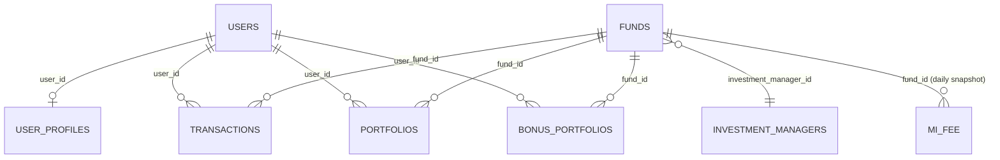

# Sayakaya Analytics — Data Schema

All tables live in BigQuery project **`sayakaya`**, region `asia-southeast2`.
There is no application database — this dashboard reads the platform's
warehouse directly, read-only.

## Dataset map

| Dataset | Key tables | Used for |
|---|---|---|
| `main` | `users`, `user_profiles`, `funds`, `portfolios`, `bonus_portfolios`, `transactions`, `switching_transactions`, `campaigns`, `investment_managers`, `snapshots`, `management_fee_logs` | Core business data: users, holdings, transactions, funds, campaigns, fees |
| `mi_fee_logs` | `mi_fee` (daily AUM + revenue per fund), `portfolio_with_code` (daily per-user-per-fund AUM by SID) | AUM history, per-investor performance over time |
| `sinvest` | `trx_history` | Raw custodian (KSEI) feed for reconciliation — every column is `STRING`, never cleaned |
| `ml` | `aum_forecast`, `tx_forecast`, `churn_model`, `churn_features` | Trained BigQuery ML models |

## Core tables (`sayakaya.main`)

### `transactions` — one row per order
| Column | Type | Notes |
|---|---|---|
| `id`, `transaction_number`, `user_id`, `fund_id`, `product_id` | | |
| `type` | STRING | `buy`, `sell`, `SWITCH_IN`, `SWITCH_OUT`, `reinvestment` |
| `status` | STRING | `completed`, `expired`, `cancelled`, `verified_by_operational`, `verified`, `completed_payment`, `pending_payment` |
| `unit` | FLOAT | |
| `amount`, `final_amount`, `value_per_unit`, `realized_gain_loss` | NUMERIC | |
| `payment_method`, `payment_gateway` | STRING | |
| `created_at`, `completed_at`, `paid_at` | TIMESTAMP | |

**"Buy/sell volume"** convention = `SUM(final_amount) WHERE status = 'completed'` for that type.

### `users` — one row per registered user
| Column | Type | Notes |
|---|---|---|
| `id` | | |
| `verification_status` | STRING | `unverified`, `verified`, `failed`, `pending_verification` |
| `created_at` | DATETIME | (note: `DATETIME`, not `TIMESTAMP` — different from `transactions.created_at`) |
| `password` | — | **exists in the table but is a forbidden column** — never selected, blocked at the query-validation layer |

### `user_profiles` — one row per user (join on `user_id = users.id`)
| Column | Type | Notes |
|---|---|---|
| `user_id`, `name`, `gender`, `occupation`, `id_address_city` | STRING | |
| `monthly_income`, `total_asset` | INT64 | |
| `investment_risk_tolerance` | STRING | |
| `birthdate` | DATE | |
| KYC fields (`id_number`, `mothers_maiden_name`, `*_photo_url`, signature columns) | — | present in the table but **off-limits** — never queried |

### `funds` — the fund catalog (~2,350 rows)
| Column | Type | Notes |
|---|---|---|
| `id`, `name` | | |
| `type` | STRING | `FIXED_INCOME`, `MONEY_MARKET`, `MIXED`, `EQUITY`, `PROTECTED` |
| `is_sharia` | BOOL | |
| `latest_nav_value` | NUMERIC | the live unit price — used everywhere holdings are valued |
| `latest_aum_value` | INT64 | fund-level AUM |
| `latest_aum_date` | DATE | |
| `management_fee` | FLOAT | |
| `listing_status` | STRING | `ACTIVE`, `INACTIVE`, `UPDATE` |
| `investment_manager_id` | | FK → `investment_managers.id` |

### `portfolios` — current holdings bought with cash (one row per user+fund)
| Column | Type | Notes |
|---|---|---|
| `id`, `user_id`, `fund_id` | | |
| `unit` | FLOAT | |
| `deleted_at` | TIMESTAMP | `NULL` = active holding |

**Active-holding filter:** `deleted_at IS NULL AND unit > 0`

### `bonus_portfolios` — holdings granted as bonus/promo (one row per user+fund)
| Column | Type | Notes |
|---|---|---|
| `user_id`, `fund_id`, `unit` | FLOAT | |
| `status` | STRING | `on_going` = active; anything else is not an active holding |

**Active-holding filter:** `status = 'on_going'`

### `investment_managers`
| Column | Type |
|---|---|
| `id`, `name`, `common_name`, `ojk_code` | STRING |
| `latest_aum_value` | INT64 |
| `latest_aum_date` | DATETIME |

## The one true "active holdings" rule

`portfolios` and `bonus_portfolios` share the same shape (`user_id`,
`fund_id`, `unit`) and together define what an investor currently holds.
Every KPI, the portfolio lookup, and the risk/income breakdowns use exactly
this union — changing this rule means updating it everywhere it's
duplicated, or dashboard numbers will silently disagree with each other.

```sql
WITH active AS (
  SELECT user_id, fund_id, unit FROM portfolios
    WHERE deleted_at IS NULL AND unit > 0        -- regular, paid-for holdings
  UNION ALL
  SELECT user_id, fund_id, unit FROM bonus_portfolios
    WHERE status = 'on_going'                     -- bonus/promo units still held
)
-- holding value = unit * funds.latest_nav_value, summed/grouped per row above
```

**AUM** (of a user, or the whole platform) = this union, valued at each
fund's `latest_nav_value` — bonus units count, because the investor still
holds them even though they didn't pay cash for them. A fund's own AUM
figure (`funds.latest_aum_value`) is a separate, fund-level number.

## `mi_fee_logs.mi_fee` — daily AUM + revenue snapshot, one row per fund per day

| Column | Type | Notes |
|---|---|---|
| `fund_id`, `fund_name` | | |
| `latest_nav_value`, `total_unit` | NUMERIC | |
| `AUM` | NUMERIC | platform AUM in that fund, that day (point-in-time) |
| `aperd_share_per_day` | NUMERIC | Sayakaya's daily revenue |
| `mi_share_per_day` | NUMERIC | investment manager's daily share |
| `created_at` | TIMESTAMP | the snapshot day |

Platform AUM on a given day = `SUM(AUM)` that day. Monthly AUM uses the
last day of the month. Revenue is summed over the range.

## `mi_fee_logs.portfolio_with_code` — daily per-investor-per-fund AUM

One row per `sid_code` + fund + day: `sid_code`, `fund`, `id` (fund id),
`fund_type`, `total_unit`, `latest_nav_value`, `amount`, `created_at`.
Powers the per-investor AUM performance chart on the Portfolio tab.

## `sinvest.trx_history` — raw custodian (KSEI) feed

Every column is `STRING`, never cleaned/typed. Used only for reconciliation
against the app's own `transactions` ledger, and as a raw-browse dataset in
the Data Explorer.

## `ml` dataset — trained BigQuery ML models

| Model | Type | Trained on |
|---|---|---|
| `aum_forecast` | ARIMA_PLUS | daily total AUM (`mi_fee_logs.mi_fee`) |
| `tx_forecast` | ARIMA_PLUS | daily completed buy volume |
| `churn_model` | Logistic regression | scores each current holder's probability of fully redeeming |
| `churn_features` | (feature table) | inputs to `churn_model` |

**Churn definition:** an investor who has ever bought, but currently holds
nothing (a propensity/current-state model, not a strict forward time-split
forecast).

Models are trained by a one-time setup script (`setup/ml_models.sql`) and
retrained on demand; the app only ever *calls* them (`ML.FORECAST` /
`ML.PREDICT`, both read operations) — it never trains from the read-only
runtime service account.

## Entity relationships



## Query-layer conventions worth knowing

- All user input into SQL is a **named parameter** (`@from`, `@userId`, …) —
  never string concatenation. The one exception is picking a table/column
  *name* from a fixed allow-list (e.g. breakdown dimension), which can't be
  used to inject arbitrary identifiers.
- Free-text SQL (SQL Lab, Ask) is additionally gated: single statement,
  must start with `SELECT`/`WITH`, blocks write/DDL keywords and the
  `password` column, and every query carries a byte-billed cost cap.
- `transactions.created_at` is `TIMESTAMP`; `users.created_at` is
  `DATETIME` — date arithmetic needs to account for the difference.
